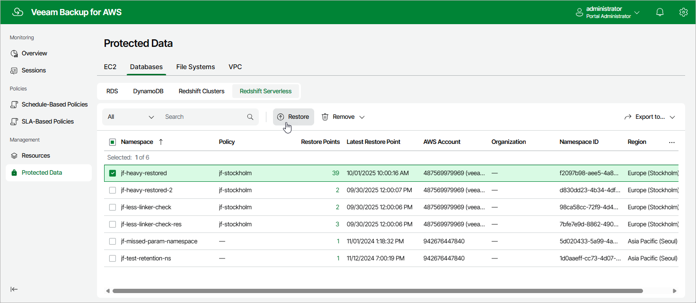

# Step 1. Launch Redshift Serverless Restore Wizard

To launch the
Redshift Serverless Restore
wizard, do the following:

1. Navigate to
   Protected Data
   >
   Databases
    >
    Redshift Serverless
   .

1. Select the Redshift Serverless namespace that you want to restore.
2. Click
   Restore
   .

Alternatively, click the link in the
Restore Points
 column. Then, in the
Available Restore Points
 window, select the necessary restore point and click
Restore
.

Page updated 2025-10-01

