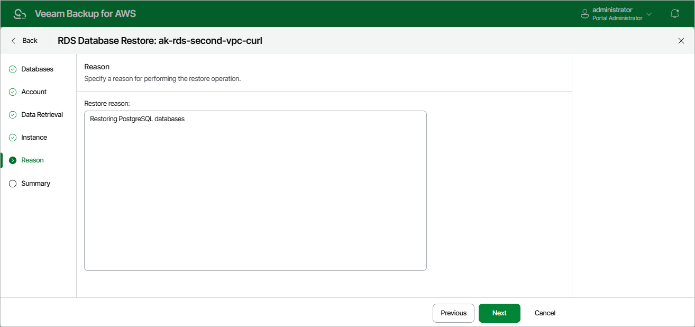

# Step 6. Specify Restore Reason

At the
Reason
step of the wizard, you can specify a reason for restoring the databases. This information will be saved to the session history, and you will be able to reference it later.

Page updated 2025-07-21

