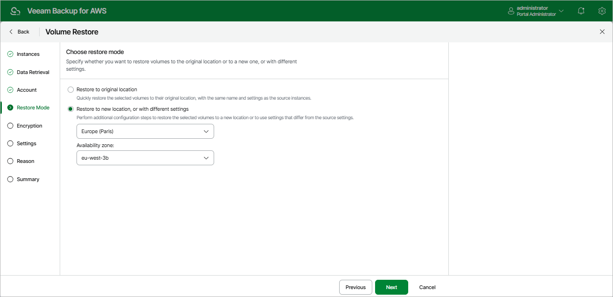

# Step 5. Choose Restore Mode

At the Restore Mode step of the wizard, choose whether you want to restore the selected EBS volumes to the original or to a custom location. If you select the Restore to new location, or with different settings option, specify the AWS Region and Availability Zone to which the backup appliance will place the restored EBS volumes.

|  |
| --- |
| Important |
| For the backup appliance to be able to perform restore to the original location, the IAM role specified at the [Account](aws_restore_volume_account.md) step of the wizard must belong to the AWS account to which the source EC2 instance belongs. |

Page updated 2026-05-22

