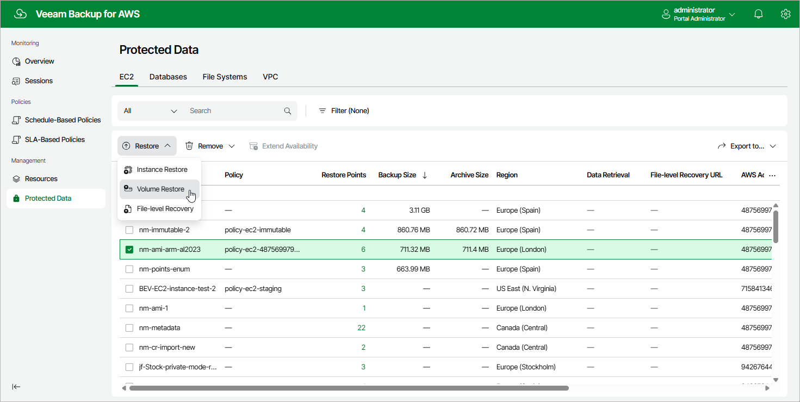

# Step 1. Launch Volume Restore Wizard

To launch the
Volume Restore
wizard, do the following:

1. Navigate to
   Protected Data
   >
    EC2
   .

1. Select the EC2 instance whose EBS volumes you want to restore.
2. Click
   Restore
    >
    Volume Restore
   .

Alternatively, click the link in the
Restore Points
 column. Then, in the
Available Restore Points
 window, select the necessary restore point and click
Restore
 >
Volume Restore
.

Page updated 2025-09-29

