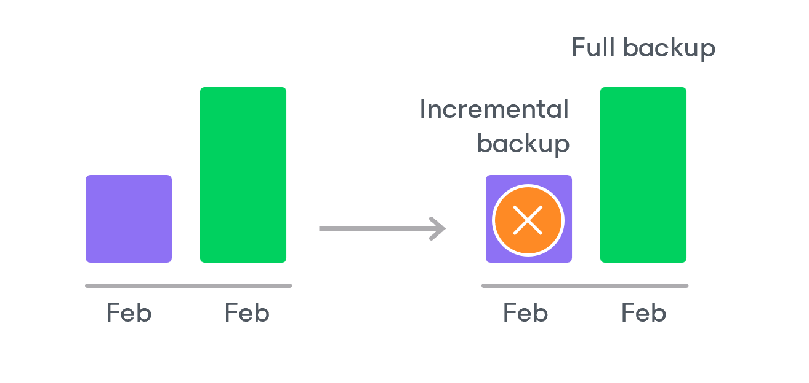

# Retention Policy for Archived Backups

For archived backups, backup appliances retain restore points for the number of days defined in backup scheduling settings as described in section [EC2 Backup Policies](aws_backup_archiving.md).

To track and remove outdated restore points from an archive backup chain, the backup appliance performs the following actions once a day:

1. The backup appliance checks the configuration database to detect archive backup repositories that contain outdated restore points.
2. If an outdated restore point exists in a archive backup repository, the backup appliance performs the following operations:

1. Deploys a worker instance in the backup account in an AWS Region where the backup repository is located to process a retention task.

By default, the backup appliance uses the default network settings of AWS Regions to deploy worker instances. However, you can add specific worker configurations. For more information on worker instances, see [Managing Worker Instances](aws_workers.md).

1. Transforms the archive backup chain in the following way:

1. The backup appliance rebuilds the full archive backup to include the data of the incremental archive backup that follows the full archive backup. To do that, the appliance injects into the full archive backup data blocks from the earliest incremental archive backup in the chain. This way, the full archive backup ‘moves’ forward in the archive backup chain.

1. The backup appliance removes the earliest incremental archive backup from the chain as redundant — this data has already been injected into the full archive backup.

1. The backup appliance repeats step 2 for all other outdated restore points found in the archive backup chain until all the restore points are removed. As data from multiple restore points is injected into the rebuilt full archive backup, the appliance ensures that the archive backup chain is not broken and that you will be able to recover your data when needed.

1. The backup appliance removes this worker instance from Amazon EC2 when the retention session completes.

|  |
| --- |
| NoteS |
| * The retention task processes only one backup chain.  * Each worker instance can process only one retention task at a time.  * The number of retention tasks that the backup appliance can handle simultaneously depends on the amount of RAM available on the backup appliance:  * If the RAM is below 8 GB, the backup appliance will be able to handle up to 32 retention tasks at a time. * If the RAM equals 9–32 GB, the backup appliance will be able to handle up to 64 retention tasks at a time. * If the RAM exceeds 33 GB, the backup appliance will be able to handle up to 128 retention tasks at a time.   If the number of retention tasks exceeds the specified limit, the remaining tasks will be queued. |

Page updated 2026-05-15

