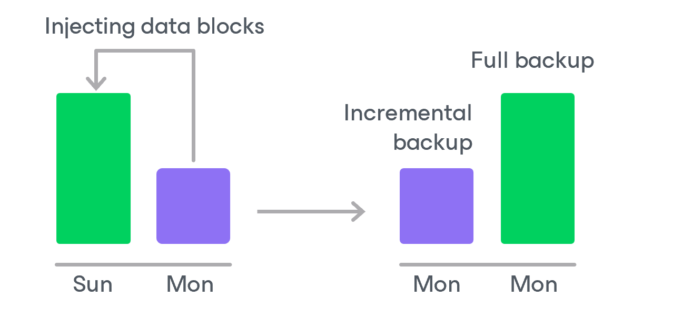
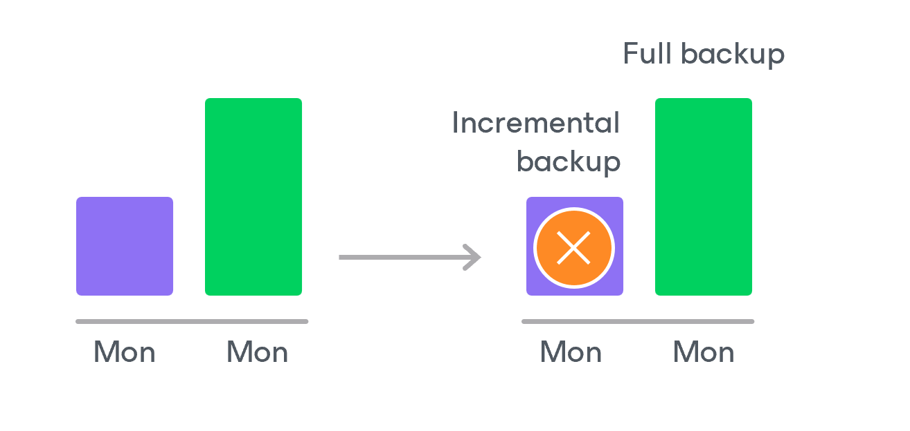

# EC2 Backup Retention

For image-level backups, backup appliances retain restore points for the number of days defined in backup scheduling settings as described in sections [Creating EC2 Backup Policies](aws_add_policy_schedule_retention.md) and [Adding SLA Templates](aws_sla_add.md).

To track and remove outdated restore points from a backup chain, the backup appliance perform the following actions once a day:

1. The backup appliance checks the configuration database to detect backup repositories that contain outdated restore points.
2. If an outdated restore point exists in a backup repository, the backup appliance performs the following operations:

1. Deploys a worker instance in the backup account in an AWS Region where the backup repository is located to process a retention task.

By default, the backup appliance uses the default network settings of AWS Regions to deploy worker instances. However, you can add specific worker configurations. For more information on worker instances, see [Managing Worker Instances](aws_workers.md).

1. Transforms the backup chain in the following way:

1. The backup appliance rebuilds the full backup to include data of the incremental backup that follows the full backup. To do that, the appliance injects into the full backup data blocks from the earliest incremental backup in the chain. This way, a full backup ‘moves’ forward in the backup chain.

1. The backup appliance removes the earliest incremental backup from the chain as redundant — this data has already been injected into the full backup.

1. The backup appliance repeats step 2 for all other outdated restore points found in the backup chain until all the restore points are removed. As data from multiple restore points is injected into the rebuilt full backup, the appliance ensures that the backup chain is not broken and that you will be able to recover your data when needed.

1. The backup appliance removes this worker instance from Amazon EC2 when the retention session completes.

|  |
| --- |
| NoteS |
| * Backup appliances run retention sessions for backup policies at 4:00 AM by default. * Each retention task can process only one backup chain.  * Each worker instance can process only one retention task at a time.  * The number of retention tasks that the backup appliance can handle simultaneously depends on the amount of RAM available on the backup appliance:  * If the RAM is below 8 GB, the backup appliance will be able to handle up to 32 retention tasks at a time. * If the RAM equals 9–32 GB, the backup appliance will be able to handle up to 64 retention tasks at a time. * If the RAM exceeds 33 GB, the backup appliance will be able to handle up to 128 retention tasks at a time.   If the number of retention tasks exceeds the specified limit, the remaining tasks will be queued. |

Related Topics

* [CBT Impact on Snapshot Retention](aws_cbt_retention.md)
* [Retention Policy for Archived Backups](aws_retention_archive.md)

Page updated 2026-05-15

