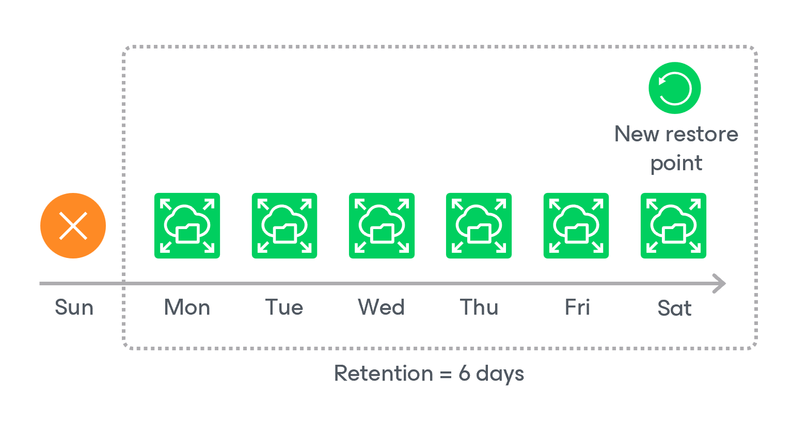

# EFS Backup Retention

For EFS file system backups, the backup appliance retains restore points for the period of time specified in [backup scheduling settings](aws_add_policy_schedule_retention_efs.md).

During every successful backup session, the backup appliance creates a restore point and saves the date, time and applied retention settings in the restore point metadata. If the backup appliance detects that the period of time for which the restore point was stored exceeds the period specified in the retention settings, it automatically removes the restore point from the EFS backup chain. You can also remove unnecessary EFS backups manually as described in section [Removing EFS Backups](aws_backups_remove_efs.md).

|  |
| --- |
| Note |
| Backup appliances do not apply retention policy to EFS backups created manually. To learn how to remove them, see [Removing EFS Backups Created Manually](aws_backups_remove_individual_efs.md). |

EFS Indexing Retention

When creating an index, the backup appliance writes to the index metadata a time stamp when the index must be deleted. The time stamp is defined by the retention specified in the backup policy settings for the first restore point with which the index is associated. If you change retention settings for the backup policy, time stamps of earlier created indexes will not change. However, even if the index must be deleted according to the time stamp, the backup appliance will not delete the index until all associated restore points are removed from the appliance configuration database.

Page updated 2026-05-15

