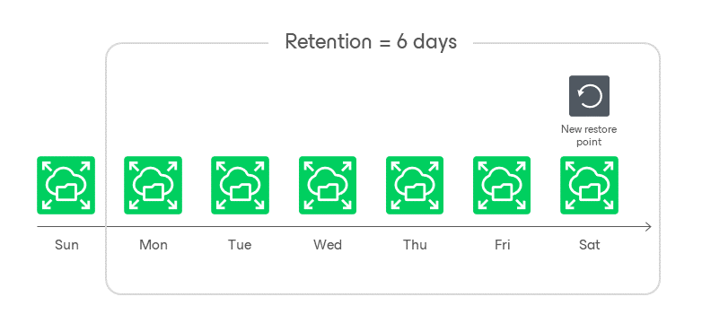

# FSx Backup Retention

For FSx file system backups, the backup appliance retains restore points for the period of time specified in [backup scheduling settings](aws_add_policy_schedule_retention_fsx.md).

During every successful backup session, the backup appliance creates a restore point and saves the date, time and applied retention settings in the restore point metadata. If the appliance detects that the period of time for which the restore point was stored exceeds the period specified in the retention settings, it automatically removes the restore point from the FSx backup chain. You can also remove unnecessary FSx backups manually as described in section [Removing FSx Backups](aws_backups_remove_fsx.md).

|  |
| --- |
| Note |
| Backup appliances do not apply retention policy to FSx backups created manually. To learn how to remove them, see [Removing FSx Backups Created Manually](aws_backups_remove_individual_fsx.md). |

Page updated 2026-05-15

