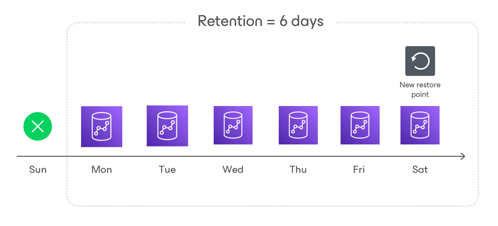

# Redshift Serverless Backup Retention

For Redshift Serverless backups, the backup appliance retains restore points for the period of time specified in [backup scheduling settings](aws_add_policy_schedule_retention_redshift_serverless.md).

During every successful backup session, the backup appliance creates a restore point and saves the date, time and applied retention settings in the restore point metadata. If the backup appliance detects that the period of time for which the restore point was stored exceeds the period specified in the retention settings, it automatically removes the restore point from the Redshift Serverless chain. You can also remove unnecessary Redshift Serverless backups manually as described in section [Removing Redshift Serverless Backups](aws_backups_remove_redshift_serverless.md).

|  |
| --- |
| Note |
| Backup appliances do not apply retention policy to Redshift Serverless backups created manually. For learn how to remove them, see [Removing Redshift Serverless Backups Created Manually](aws_backups_remove_individual_redshift_serverless.md). |

Page updated 2026-05-15

