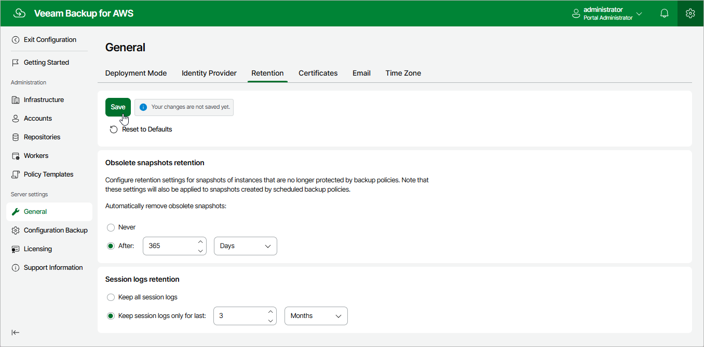

# Configuring Global Retention Settings

You can configure global retention settings to specify for how long the following data will be retained by the backup appliance:

* [Obsolete snapshots and replicas](#snapshots)
* [Session records](#sessions)

Configuring Retention Settings for Obsolete Snapshots and Replicas

When you create a backup policy, you can configure a retention period for cloud-native snapshots and snapshot replicas produced by this policy. However, you may need to define a time limit that applies to all backup policies to save space in the appliance configuration database. To do that, you can configure global snapshot retention settings to instruct the backup appliance to remove all obsolete snapshots from both the configuration database and AWS.

|  |
| --- |
| Notes |
| * Cloud-native snapshots and snapshot replicas are considered obsolete if the backup policy that produced them is disabled or no longer exists, the backup schedule used to create them is disabled, or the resource is no longer in the backup policy scope. * Obsolete snapshot retention settings apply to all EC2 and RDS cloud-native snapshots, as well as to snapshot replicas produced by the backup appliance (you can identify these snapshots by the Veeam backup appliance ID tag). The only exception is [snapshots created manually](aws_snapshot_manual.md) — to learn how to remove these snapshots, see [Removing EC2 Backups and Snapshots](aws_backups_remove_manual_snapshots.md).  * The backup appliance does not prioritize global retention settings over retention settings configured for backup policies. If snapshots or snapshot replicas produced by a backup policy are older than the global retention period, these snapshots will not be removed based on the global retention settings. |

To configure retention settings for obsolete snapshots and replicas, do the following:

1. Switch to the Configuration page.
2. Navigate to General > Retention.
3. In the Obsolete snapshots retention section, select the After option to specify the number of days (or months) during which the backup appliance will keep obsolete snapshots in the appliance configuration database and AWS.
4. The number must be between 15 and 36135 for days, between 1 and 1188 for months and between 1 and 99 for years.
5. Click Save.

|  |
| --- |
| Tip |
| Use the Never option if you do not want the backup appliance to apply any global retention settings to obsolete snapshots. In this case, the backup appliance will remove obsolete snapshots according to retention settings configured for backup policies. |

Configuring Retention Settings for Session Records

The backup appliance stores records for all sessions of performed data protection and disaster recovery operations in the appliance configuration database on the additional data disk attached to the backup appliance. These session records are removed from the configuration database according to their own retention settings. By default, session logs are stored for 3 months.

To configure retention settings for session records, do the following:

1. In the Session logs retention section, select one of the following options:

* Select the Keep all session logs option if you do not want the backup appliance to remove session records.

* Select the Keep session logs only for last option if you want to specify the number of days (or months) during which the backup appliance must keep session records in the appliance configuration database.

If you select this option, the backup appliance will remove all session records that are older than the specified time limit.

1. Click Save.

|  |
| --- |
| Important |
| Retaining all session records in the appliance configuration database may overload the data EBS volume. By default, the volume comes with 20 GB of storage capacity. If you choose not to remove sessions records at all, consider increasing the volume capacity to avoid runtime problems. |

Page updated 2026-05-22

