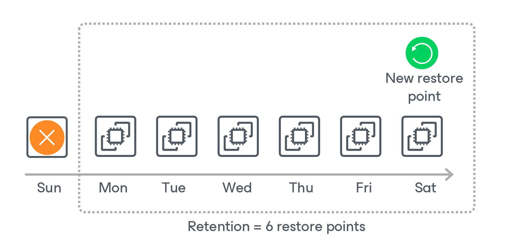

# EC2 Snapshot Retention

Depending on the data protection scenario, the backup appliance retains cloud-native snapshots as follows:

* In days/months/years — for snapshots and snapshot replicas produced by SLA-based backup policies.

Restore points can be kept in a snapshot chain only for the period of time defined in snapshot scheduling settings as described in section [Adding SLA Templates](aws_sla_add_snapshot_settings.md). If the backup appliance detects that a restore point is older than the specified time limit, it removes this restore point from the snapshot chain.

* In restore points — for snapshots and snapshot replicas produced by schedule-based backup policies.

A snapshot chain can contain only the allowed number of restore points defined in backup scheduling settings as described in section [Creating Schedule-Based EC2 Backup Policies](aws_add_policy_schedule_retention.md). If the backup appliance detects that the number of restore points in the snapshot chain exceeds the retention limit, it removes the earliest restore point from the chain.

Regardless of the number of restore points that you specify in the retention policy settings, the backup appliance permanently retain an additional cloud-native snapshot in the chain by design, which is required for proper CBT functioning. To learn how the CBT mechanism works, see [Changed Block Tracking](aws_cbt.md). For more information on the snapshot deletion process, see [AWS Documentation](https://docs.aws.amazon.com/AWSEC2/latest/UserGuide/ebs-deleting-snapshot.html#ebs-deleting-snapshot-incremental).

|  |
| --- |
| Notes |
| * If you add an EC2 instance to an SLA-based policy after it was previously protected by a schedule-based policy, the backup appliance will start applying the retention settings configured in the SLA template to the entire snapshot chain. * Retention policy settings configured when creating schedule-based backup policies and SLA templates do not apply to cloud-native snapshots taken manually. However, you can configure their own retention settings as described in section [Performing EC2 Backup](aws_snapshot_manual.md), or remove these snapshots manually as described in section [Managing Backed-Up EC2 Instance Data](aws_backups_view_ec2.md). |

Related Topics

* [CBT Impact on Snapshot Retention](aws_cbt_retention.md)
* [Configuring Global Retention Settings](aws_retention_settings.md#snapshots)

Page updated 2026-05-15

