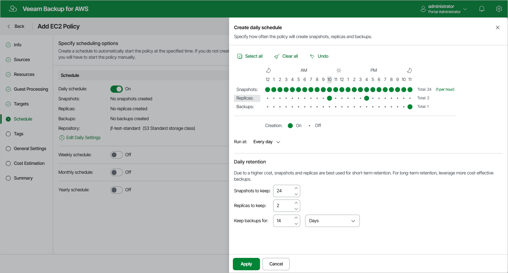

# Specifying Daily Schedule

To create a daily schedule for the backup policy, at the Schedule step of the wizard, do the following:

1. Set the Daily schedule toggle to On and click Edit Daily Settings.
2. In the Create daily schedule section, select hours when the backup policy will create cloud-native snapshots, snapshot replicas or image-level backups.

If you want to protect EC2 instance data more frequently, you can instruct the backup policy to create multiple cloud-native snapshots per hour. To do that, click the link to the right of the Snapshots hour selection area, and specify the number of cloud-native snapshots that the backup policy will create within an hour.

|  |
| --- |
| Note |
| The backup appliance does not create snapshot replicas and image-level backups independently from cloud-native snapshots. That is why when you select hours for snapshot replicas and image-level backups, the same hours are automatically selected for cloud-native snapshots. To learn how backup appliances performs backup, see [EC2 Backup](aws_backup_hiw_ec2.md). |

1. Use the Run at drop-down list to choose whether you want the backup policy to run everyday, on work days (Monday through Friday) or on specific days.
2. In the Daily retention section, configure retention policy settings for the daily schedule:

* For cloud-native snapshots and snapshot replicas, specify the number of restore points that you want to keep in cloud-native snapshot and snapshot replica chains.

If the restore point limit is exceeded, the backup appliance removes the earliest restore point from the chain. For more information, see [EC2 Snapshot Retention](aws_retention_snapshots.md).

* For image-level backups, specify the number of days (or months) for which you want to keep restore points in a backup chain.

If a restore point is older than the specified time limit, the backup appliance removes the restore point from the chain. For more information, see [EC2 Backup Retention](aws_retention_backup.md).

1. To save changes made to the backup policy settings, click Apply.

|  |
| --- |
| Tip |
| The backup appliance will start applying the configured retention settings as soon as the backup policy produces restore points. Even if you disable the daily schedule after the restore points are created, the retention policy will still be applied to these restore points. As a workaround, you can modify the configured retention settings. |

Considerations and Limitations

When you configure retention policy settings, consider the following:

* For the backup appliance to be able to use the Changed Block Tracking (CBT) mechanism when processing EC2 instance data, you must keep at least one cloud-native snapshot in the snapshot chain.

* Regardless of the number of restore points that you specify, the backup appliance permanently retains an additional cloud-native snapshot in the chain by design, which is required for proper CBT functioning.

To learn how the CBT mechanism works, see [Changed Block Tracking](aws_cbt.md).

Page updated 2026-05-21

