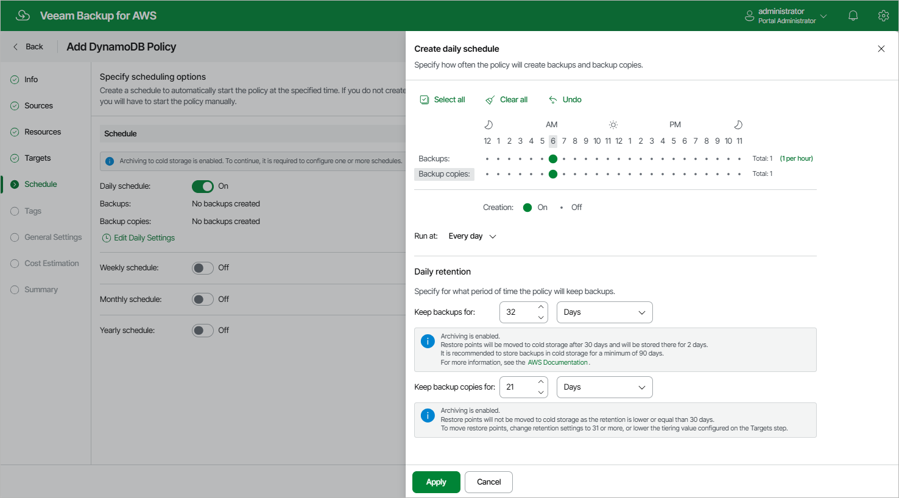

# Specifying Daily Schedule

To create a daily schedule for the backup policy, at the Schedule step of the wizard, do the following:

1. Set the Daily schedule toggle to On and click Edit Daily Settings.
2. In the Create daily schedule section, select hours when the backup policy will create table backups and backup copies.

If you want to protect table data more frequently, you can instruct the backup policy to create multiple backups per hour. To do that, click the link to the right of the Backups hour selection area, and specify the number of backups that the backup policy will create within an hour.

|  |
| --- |
| Note |
| The backup appliance does not create backup copies independently from table backups. That is why when you select hours for backup copies, the same hours are automatically selected for backups. To learn how backup appliances perform backup, see [DynamoDB Backup](aws_backup_hiw_dynamo.md). |

1. Use the Run at drop-down list to choose whether you want the backup policy to run everyday, on work days (Monday through Friday) or on specific days.
2. In the Daily retention section, configure retention policy settings for the daily schedule. For backups and backup copies, specify the number of days (or months) for which you want to keep restore points in a backup chain.

If a restore point is older than the specified time limit, the backup appliance removes the restore point from the chain. For more information, see [DynamoDB Backup Retention](aws_retention_backup_dynamo.md).

1. To save changes made to the backup policy settings, click Apply.

|  |
| --- |
| Tip |
| The backup appliance will start applying the configured retention settings as soon as the backup policy produces restore points. Even if you disable the daily schedule after the restore points are created, the retention policy will still be applied to these restore points. As a workaround, you can modify the configured retention settings. |

Page updated 2026-05-21

