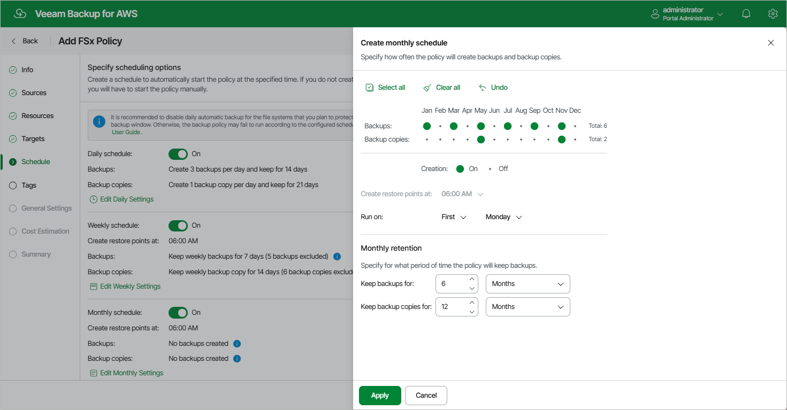

# Specifying Monthly Schedule

To create a monthly schedule for the backup policy, at the Schedule step of the wizard, do the following:

1. Set the Monthly schedule toggle to On and click Edit Monthly Settings.
2. In the Create monthly schedule section, select months when the backup policy will create file system backups and backup copies.

|  |
| --- |
| Note |
| The backup appliance does not create backup copies independently from FSx backups. That is why when you select hours for backup copies, the same hours are automatically selected for backups. To learn how backup appliances perform backup, see [FSx Backup](aws_backup_hiw_fsx.md). |

1. Use the Create restore point at and Run on drop-down lists to schedule a specific time and day for the backup policy to run.

|  |
| --- |
| Notes |
| * If you have selected a specific time for the backup policy to run at the Weekly schedule section of the Schedule step of the wizard, you will not be able to change the time for the monthly schedule unless you select the On day option.  * If you select the On day option, [harmonized scheduling](aws_harmonized_scheduling_fsx.md) cannot be guaranteed. |

1. In the Monthly retention section, configure retention policy settings for the monthly schedule. For backups and backup copies, specify the number of days (or months) for which you want to keep restore points in a backup chain.

If a restore point is older than the specified time limit, the backup appliance removes the restore point from the chain. For more information, see [FSx Backup Retention](aws_retention_backup_fsx.md).

1. To save changes made to the backup policy settings, click Apply.

|  |
| --- |
| Tip |
| The backup appliance will start applying the configured retention settings as soon as the backup policy produces restore points. Even if you disable the monthly schedule after the restore points are created, the retention policy will still be applied to these restore points. As a workaround, you can modify the configured retention settings. |

Page updated 2026-05-21

