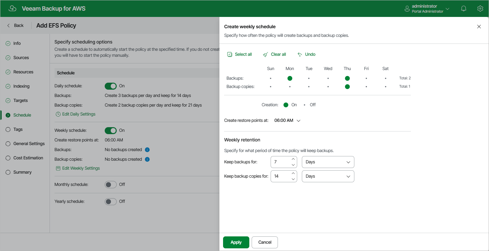

# Specifying Weekly Schedule

To create a weekly schedule for the backup policy, at the Schedule step of the wizard, do the following:

1. Set the Weekly schedule toggle to On and click Edit Weekly Settings.
2. In the Create weekly schedule section, select weekdays when the backup policy will create file system backups and backup copies.

|  |
| --- |
| Note |
| The backup appliance does not create backup copies independently from file system backups. That is why when you select days to create backup copies, the same days are automatically selected for backups. To learn how backup appliances perform backup, see [EFS Backup](aws_backup_hiw_efs.md). |

1. Use the Create restore point at drop-down list to schedule a specific time for the backup policy to run.
2. In the Weekly retention section, configure retention policy settings for the weekly schedule. For backups and backup copies, specify the number of days (or months) for which you want to keep restore points in a backup chain.

If a restore point is older than the specified time limit, the backup appliance removes the restore point from the chain. For more information, see [EFS Backup Retention](aws_retention_backup_efs.md).

1. To save changes made to the backup policy settings, click Apply.

|  |
| --- |
| Tip |
| The backup appliance will start applying the configured retention settings as soon as the backup policy produces restore points. Even if you disable the weekly schedule after the restore points are created, the retention policy will still be applied to these restore points. As a workaround, you can modify the configured retention settings. |

Page updated 2026-05-21

