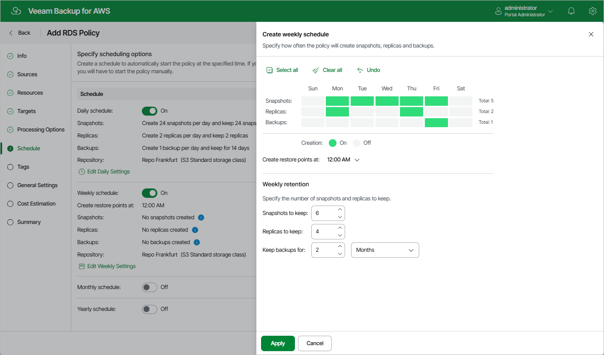

# Specifying Weekly Schedule

To create a weekly schedule for the backup policy, at the Schedule step of the wizard, do the following:

1. Set the Weekly schedule toggle to On and click Edit Weekly Settings.
2. In the Create weekly schedule section, select weekdays when the backup policy will create cloud-native snapshots, snapshot replicas or image-level backups.

|  |
| --- |
| Note |
| The backup appliance does not create snapshot replicas and image-level backups independently from cloud-native snapshots. That is why when you select days to create snapshot replicas and image-level backups, the same days are automatically selected for cloud-native snapshots. To learn how backup appliances perform backup, see [RDS Backup](aws_backup_hiw_rds.md). |

1. Use the Create restore point at drop-down list to schedule a specific time for the backup policy to run.
2. In the Weekly retention section, configure retention policy settings for the weekly schedule:

* For cloud-native snapshots and snapshot replicas, specify the number of restore points that you want to keep in cloud-native snapshot and snapshot replica chains.

If the restore point limit is exceeded, the backup appliance removes the earliest restore point from the chain. For more information, see [RDS Snapshot Retention](aws_retention_snapshots_rds.md).

* For image-level backups, specify the number of days (or months) for which you want to keep restore points in a backup chain.

If a restore point is older than the specified time limit, the backup appliance removes the restore point from the chain. For more information, see [RDS Backup Retention](aws_retention_backup_rds.md).

1. To save changes made to the backup policy settings, click Apply.

|  |
| --- |
| Tip |
| The backup appliance will start applying the configured retention settings as soon as the backup policy produces restore points. Even if you disable the weekly schedule after the restore points are created, the retention policy will still be applied to these restore points. As a workaround, you can modify the configured retention settings. |

Page updated 2026-05-21

