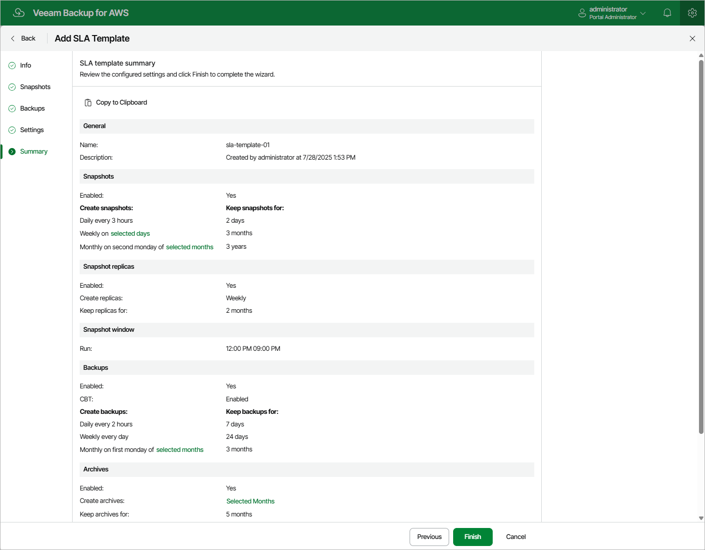

# Step 6. Finish Working With Wizard

At the Summary step of the wizard, review configuration information and click Finish.

|  |
| --- |
| Tip |
| After you create an SLA template and assign it to a number of SLA-based backup policies as described in section [Performing Backup Using Web UI](aws_add_sla_policy_target_settings.md), you will be able to see the full list of all the related policies on the SLA page. To do that, select the necessary template and click the link in the Currently Assigned column. |

Page updated 2026-06-03

