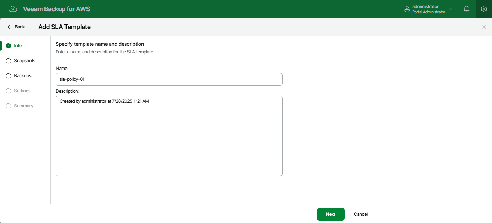

# Step 2. Specify Template Name

At the
Info
step of the wizard, enter a name for the new SLA template and provide a description for future reference. The maximum length of the name is 127 characters; the maximum length of the description is 255 characters.

Page updated 2025-11-21

