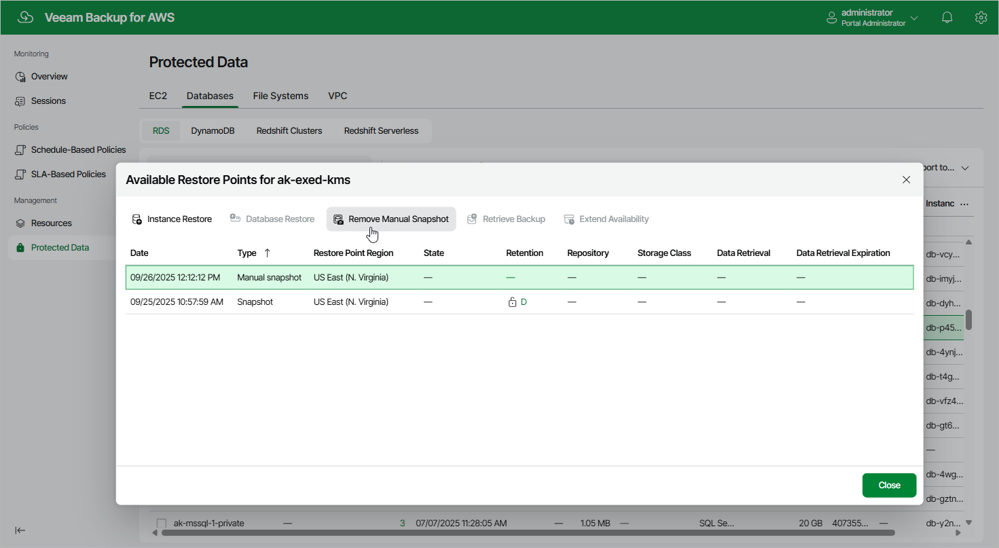

# Removing RDS Snapshots Created Manually

To remove all cloud-native snapshots created for a DB instance or an Aurora DB cluster manually, follow the instructions provided in the
[Removing RDS Backups and Snapshots](aws_snapshots_remove_rds.md)
section. If you want to remove a specific snapshot created manually, do the following:

1. Navigate to
   Protected Data
    >
   Databases
    >
   RDS
   .
2. Select the necessary resource, and click the link in the
   Restore Points
    column.
3. In the
   Available Restore Points
    window, select a snapshot that you want to remove, and click
   Remove Manual Snapshot
   .

Related Topics

* [Creating Snapshots Manually](aws_snapshot_manual_rds.md)
* [Removing RDS Backups and Snapshots](aws_snapshots_remove_rds.md)

Page updated 2025-09-26

