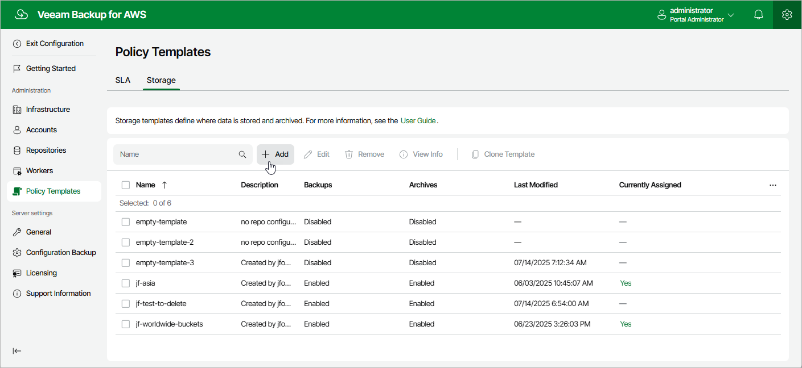

# Step 1. Launch Add Storage Template Wizard

To launch the
Add Storage Template
wizard, do the following:

1. Switch to the
   Configuration
    page.

1. Navigate to
   Policy Templates
    >
    Storage
   .

1. Click
   Add
   .

Page updated 2025-07-29

