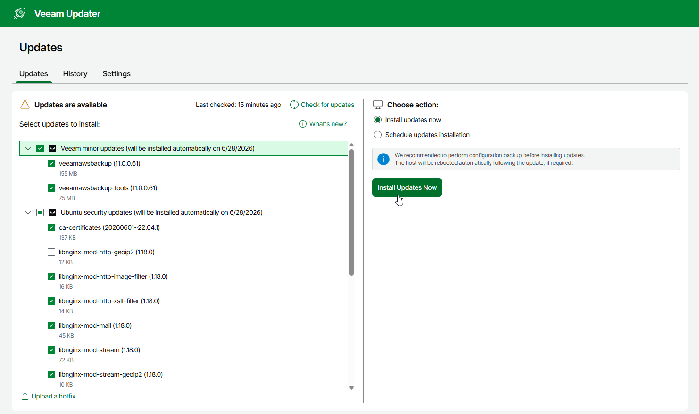
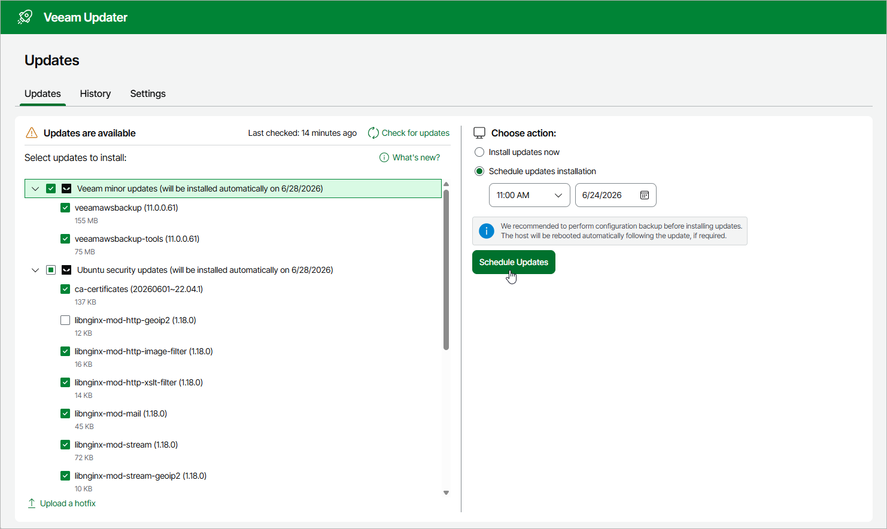

# Installing Updates

To download and install new available product and software package updates, you can use either of the following options:

* [Install updates immediately](#install)
* [Postpone update installation](#schedule)

You can also [configure custom settings](#custome_update_settings) that will be used to install software package updates automatically on a regular basis.

|  |
| --- |
| Important |
| * Updating standalone backup appliances is supported using the Veeam Updater service only.  * Installing software package updates on the backup appliance managed by a Veeam Backup & Replication server is supported using the Veeam Updater service only. |

Installing Updates

|  |
| --- |
| Important |
| Before you install a product update, make sure that all backup policies are both disabled and stopped, and no restore tasks are currently executing. Otherwise, the update process will interrupt the running activities, which may result in data loss. |

To download and install available product and software package updates:

1. Open the Veeam Updater page. To do that:

1. Switch to the Configuration page.
2. Navigate to Support Information.
3. On the Updates tab, click Check and View Updates.

1. On the Veeam Updater page, do the following:

1. In the Updates are available section, select check boxes next to the necessary updates.
2. In the Choose action section, select the Install updates now option and click Install Updates Now.

|  |
| --- |
| Note |
| The updater may require you to read and accept the Veeam license agreement and licensing policy, as well as the license agreements of 3rd party components that Veeam incorporates, and the license agreements of required software. If you reject the agreements, you will not be able to continue installation. |

The backup appliance will download and install the updates; the results of the installation process will be displayed on the History tab. Keep in mind that it may take several minutes for the installation process to complete.

|  |
| --- |
| Note |
| When installing product and software package updates, the backup appliance restarts all services running on the backup appliance, including the Web UI service. That is why the backup appliance will log you out when the update process completes. |

Scheduling Update Installation

You can instruct the backup appliance to download and install available product and software package updates on a specific date at a specific time:

1. On the Veeam Updater page, in the Updates are available section, select check boxes next to the necessary updates.
2. In the Choose action section, do the following:

1. Select the Schedule updates installation option and configure the necessary schedule.

When selecting a date and time when updates must be installed, make sure no backup policies are scheduled to run on the selected time. Otherwise, the update process will interrupt the running activities, which may result in data loss.

1. Click Schedule Updates.

The backup appliance will automatically download and install the updates on the selected date at the selected time; the results of the installation process will be displayed on the History tab.

|  |
| --- |
| Important |
| For the backup appliance to be able to download and install available updates, you must open a number of ports required for outbound internet access. For more information, see [Ports](aws_ports.md#appliance). |

Configuring Update Settings

Starting from backup appliance version 11, the backup server that manages the backup appliance propagates its software update settings to the appliance. However, you can configure custom settings that will be used to install software package updates automatically. For more information, see [Configuring Update Settings](aws_configuring_updates.md).

Related Topics

[Viewing Updates History](aws_updates_history.md)

Page updated 2026-07-17

