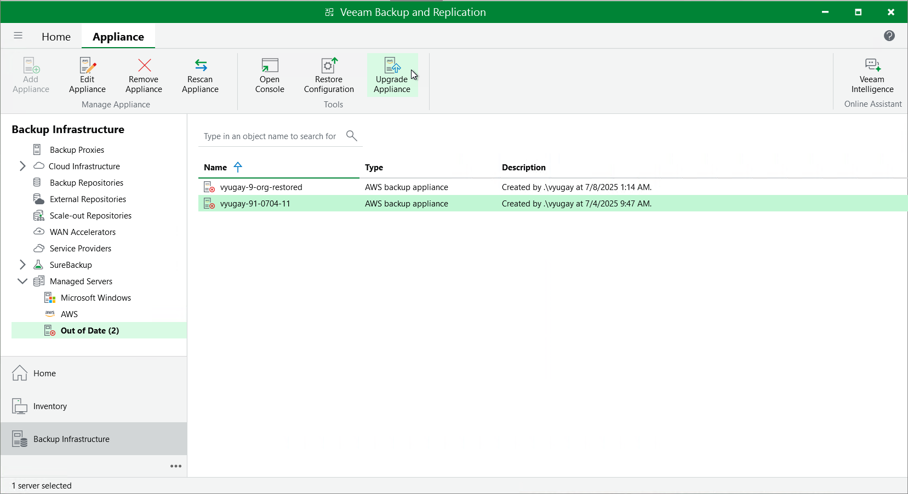

# Upgrading Backup Appliances

Veeam Plug-in for AWS allows you to check for new product versions and available software package updates. It is recommended that you timely install available software package updates to avoid performance issues while working with the product. For example, timely installed security updates may help you prevent potential security issues and reduce the risk of compromising sensitive data.

Starting from version 6a, you can upgrade backup appliances from the Veeam Backup & Replication console only. Upgrade to backup appliance version 11 is supported from appliance version 4 or later. To upgrade from an earlier version, you must first perform upgrade to version 4 as described in section [Installing Updates](aws_updates_install.md).

|  |
| --- |
| Important |
| Before you upgrade a backup appliance, check whether the backup appliance version is compatible with the current version of Veeam Plug-in for AWS. For more information, see [System Requirements](aws_system_requirements.md#versions). |

How to Perform Upgrade

To upgrade a backup appliance, do the following:

1. In the Veeam Backup & Replication console, open the Backup Infrastructure view.
2. Navigate to Managed Servers.
3. Select the necessary backup appliance and click Upgrade Appliance on the ribbon.

Alternatively, right-click the appliance and select Upgrade.

If you remove the upgraded backup appliance that previously used a marketplace license, then you will no longer be able to switch to the Paid marketplace license, and the appliance will operate using the Free marketplace license. For more information on license editions, see [Licensing](aws_licensing.md).

|  |
| --- |
| Note |
| When you upgrade the backup appliance from version 6 or earlier to version 11, its operating system is upgraded to Ubuntu 22.04 LTS, and its configuration database is upgraded to PostgreSQL 15. For more information on the upgrade process, see [Upgrading to Version 11 from Version 6 or Earlier](aws_upgrade_vb_console.md). |

Updating Default Backup Restore IAM Role

During upgrade, Veeam Backup & Replication updates only the permissions of the Default Backup Restore IAM role created on the backup appliance during installation. Depending on the version running on the appliance, the following will happen:

* If you upgrade the backup appliance from version 6a or earlier to version 11, Veeam Backup & Replication will assign all existing permissions to the role.
* If you upgrade the backup appliance from version 7 to version 11, Veeam Backup & Replication will update only the permissions that were previously selected for the role in the [Add IAM Role](aws_iam_roles_specify_permissions.md) wizard.

To learn how to modify permissions of the Default Backup Restore IAM role, see [Editing IAM Role Settings](aws_iam_roles_edit.md).

Page updated 2026-06-11

