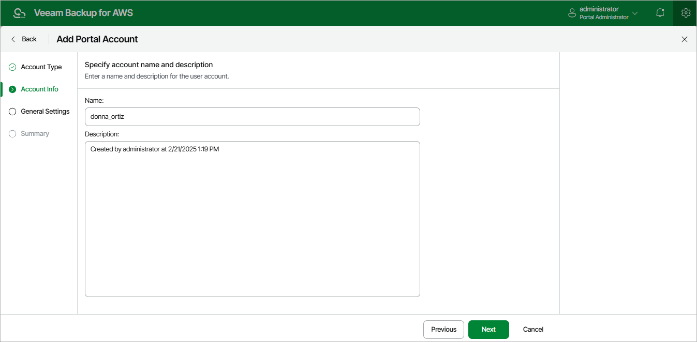

# Step 3. Specify Account Name and Description

At the Account Info step of the wizard, enter a name for the new user account and provide a description for future reference. The maximum length of the name is 32 characters for the user and 125 characters for the user identity from your identity provider. The following characters are supported: lowercase Latin letters, numeric characters, underscores and dashes; the dollar sign ($) is supported but only if it the last character of the name.

|  |
| --- |
| Important |
| * You cannot use admin as the account name. * If you have selected the Identity Provider account option at step 1, the name specified for a user account must match the value of an attribute that the identity provider will send to the backup appliance authenticate the user. For more information, see [Configuring SSO Settings](aws_sso_settings.md#IdpAttribute). |

Page updated 2026-05-20

