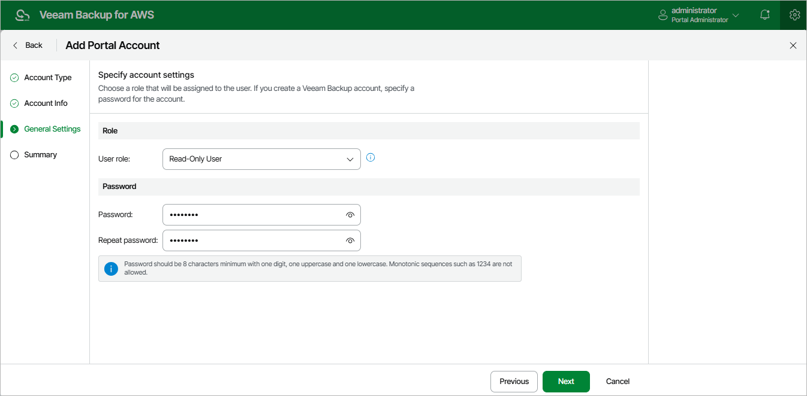

# Step 4. Specify General Settings

At the General Settings step of the wizard, select a role for the user account. For more information on user roles, see [Managing User Accounts](aws_accounts_vba_users.md).

If you have selected the Veeam Backup for AWS account option at step 2, specify a password for the new user account.

Page updated 2026-05-20

