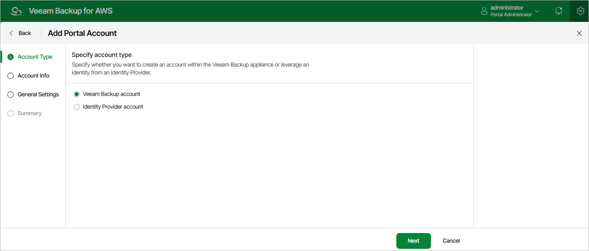

# Step 2. Choose Account Type

At the Account Type step of the wizard, choose whether you want to create a new user or to retrieve a user identity from your identity provider. To retrieve user identities from the identity provider, you must first [configure single sign-on settings](aws_sso_settings.md).

Page updated 2026-05-20

