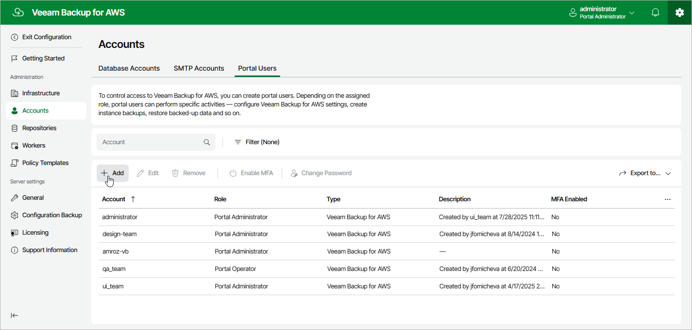

# Step 1. Launch Add Account Wizard

To launch the
Add Portal Account
wizard, do the following:

1. Switch to the
   Configuration
    page.
2. Navigate to
   Accounts
   >
    Portal Users
   .
3. Click
   Add
   .

Page updated 2025-08-20

