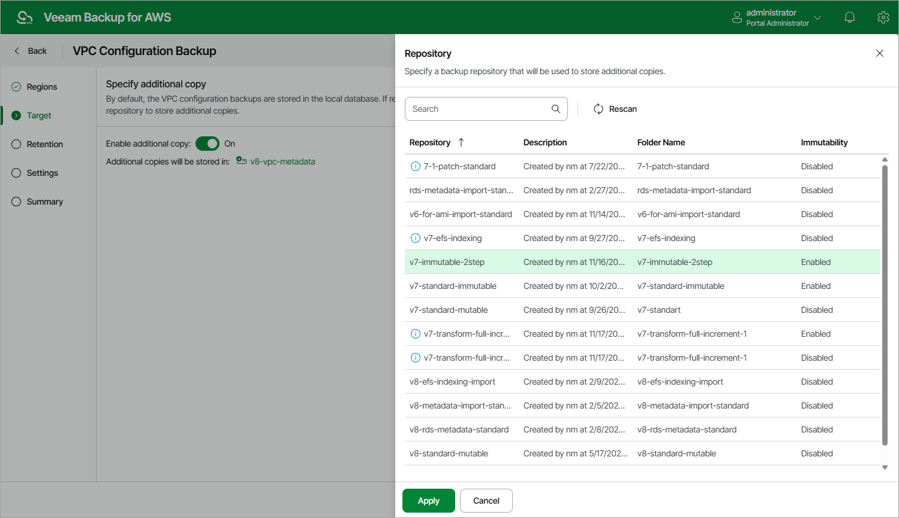

# Step 3. Enable Additional Backup Copy

By default, the backup appliance stores VPC configuration backups in its configuration database. You can instruct the backup appliance to save additional VPC configuration backup copies to a backup repository. To do that:

1. At the Target step of the wizard, set the Enable additional copy toggle to On.
2. In the Repository window, select either a backup repository or a storage vault that will be used to store the additional configuration backup copies.

For a repository to be displayed in the Repository list, it must be added to the backup appliance as described in sections [Adding Backup Repositories Using Web UI](aws_repositories_add_ui.md) and [Adding Storage Vaults Using Console](aws_repositories_add_vault_console.md). The list shows only repositories of the S3 Standard or S3 Standard-IA storage classes that have encryption enabled and immutability disabled.

|  |
| --- |
| Important |
| If you plan to use a storage vault as as the target location, make sure it has the Read-Write status. Otherwise, the backup operation will fail to complete successfully. To learn how to check the storage vault status, see the Veeam Data Cloud User Guide, section [Viewing Vault Assignments](https://helpcenter.veeam.com/docs/vdc/userguide/vault_assignments.html). |

1. To save changes made to the backup policy settings, click Apply.

|  |
| --- |
| Note |
| When choosing a backup repository, consider the following:   * If you want to encrypt the backed-up VPC configuration data, select a repository with encryption enabled. * If you want to make the backed-up VPC configuration data immutable for the period specified in [retention settings](aws_vpc_policy_retention.md) of the backup policy, select a repository with immutability enabled. Note that the backup appliance does not apply generations to VPC backups.   For more information on encryption and immutability, see [Adding Backup Repositories Using Web UI](aws_repositories_add_ui.md). |

Page updated 2026-06-03

