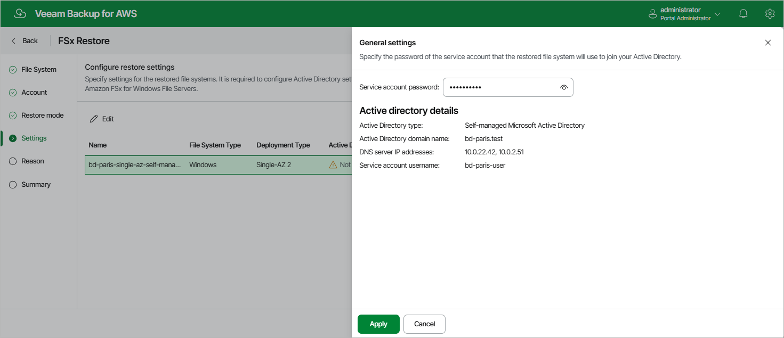

# Restoring to Original Location

[This step applies only if you have selected the Restore to original location option at the Restore Mode step of the wizard, and if the selected file system is an Amazon FSx for Windows File Server file system joined to a self-managed Microsoft Active Directory (AD)]

At the Settings step of the wizard, check Active Directory settings that will be used to authenticate against the Microsoft AD to which the restored file system will be connected, and provide the password of the service account.To do that, select the file system and click Edit.

|  |
| --- |
| Note |
| The backup appliance does not store client secrets in its configuration database. |

For more information on Microsoft Active Directory in FSx for Windows File Server, see [AWS Documentation](https://docs.aws.amazon.com/fsx/latest/WindowsGuide/aws-ad-integration-fsxW.html).

Page updated 2026-05-22

