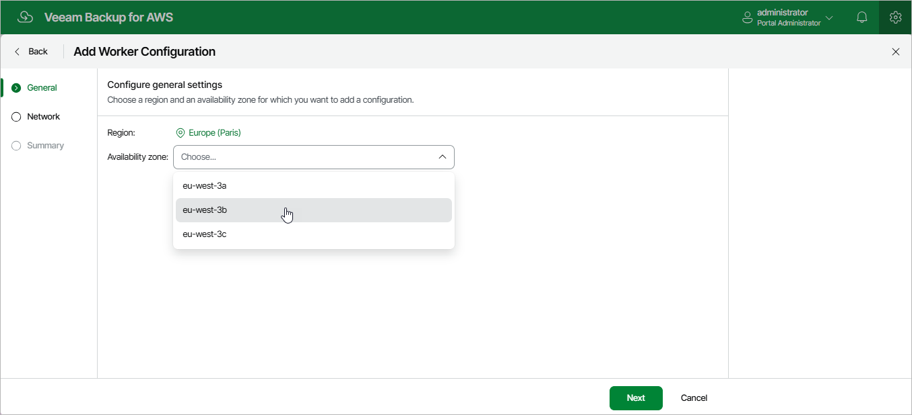

# Step 2. Specify General Settings

At the General step of the wizard, select an AWS Region and Availability Zone for which you want to configure network settings.

If you create the worker configuration that will be used to perform EC2 backup operations, you can select any Availability Zone in the specified AWS Region. The backup appliance will still be able to perform the operations even if the selected zone will differ from the Availability Zone where the processed EC2 instances reside.

Page updated 2026-05-20

