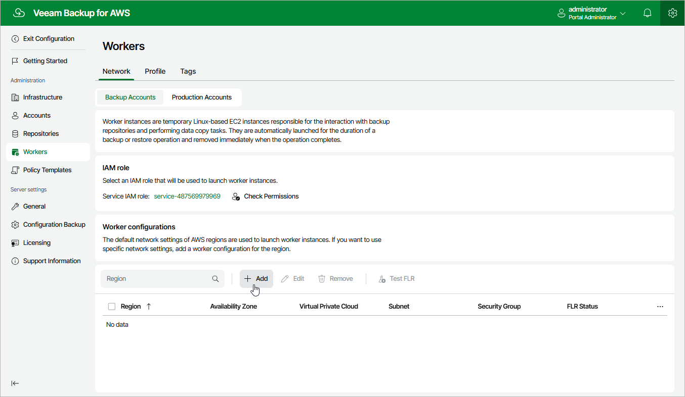

# Step 1. Launch Add Worker Configuration Wizard

To launch the Add Worker Configuration wizard, do the following:

1. Switch to the
   Configuration
    page.
2. Navigate to
   Workers
    >
   Network
   .
3. In the
   Worker configurations
    section, click
   Add
   .

Page updated 2025-07-04

