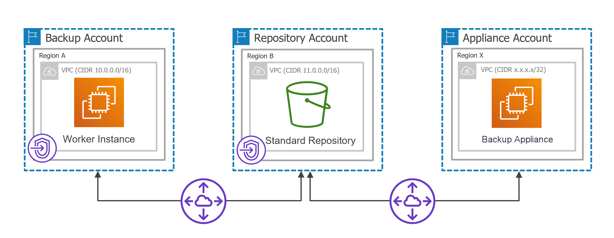
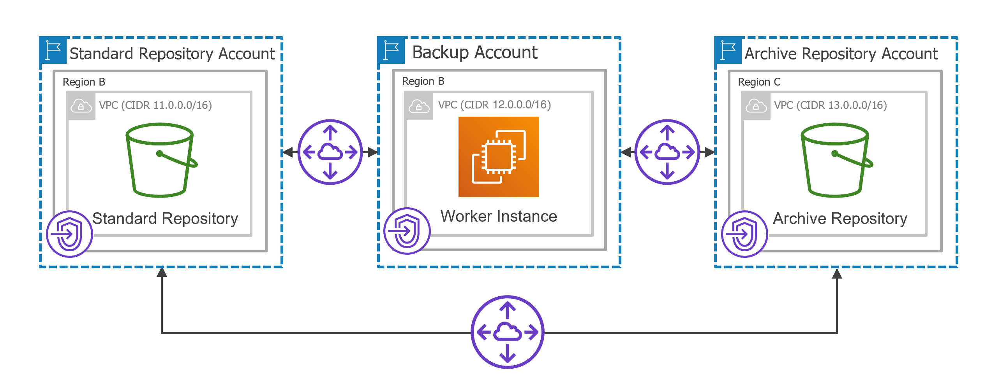

# Worker Instances in Private Environment

Backup appliances automatically deploy worker instances in Amazon EC2 for the duration of backup, restore and retention processes and removes it immediately after the processes complete. A backup appliance deploys one worker instance per each processed AWS resource. To minimize cross-region traffic charges, depending on the data protection or disaster recovery operation, the backup appliance deploys the worker instance in [specific locations](aws_workers_location.md).

|  |
| --- |
| Important |
| If you want worker instances to operate in a private network, consider that worker instances must have outbound access to specific [AWS services](aws_system_requirements_aws_services.md#workers). |

By default, backup appliances use public access to communicate with worker instances. However, you can instruct a backup appliance to deploy worker instances without public IPv4 addresses, and then configure worker settings to allow private network access. One possible solution is to enable the private network deployment functionality in the backup appliance Web UI, create interface endpoints and ensure connectivity between your resources:

1. Set the Private network deployment toggle to On as described in section [Configuring Private Network Deployment](aws_enable_private_network_deployment.md).
2. To allow worker instances to access AWS services, create specific VPC interface endpoints for all subnets to which the worker instances will be connected.

For the list of VPC interface endpoints required for backup and restore operations, see [Configuring Private Networks](aws_configuring_private_networks.md#worker_operations).

1. To enable route traffic between different VPCs, create peering connections between those VPCs.
2. To enable private traffic between different VPCs, add routes to the route tables associated with the subnets of those VPCs.
3. To allow the backup appliance to deploy worker instances based on VPC networks and subnets for which you have created VPC interface endpoints, add the necessary worker configurations as described in section [Managing Worker Configurations](aws_worker_settings.md).

If you do not add specific worker configurations, the backup appliance will use either the default or the [most appropriate network settings](aws_workers_location.md) of AWS Regions.

The actions you perform depend on specific use cases. For more information, see [Example 1. Creating EC2 Backups](#perform_backup) and [Example 2. Archiving EC2 Backups](#perform_backup_archived).

|  |
| --- |
| Important |
| If you enable the private network deployment functionality, consider the following:   * Worker instances will communicate with the Amazon S3 service through a private S3 endpoint specified in [repository settings](aws_repositories_add_s3endpoint.md) — but only to perform data protection and recovery tasks, as well as retention tasks. To access the service while restoring the backup appliance configuration, exporting VPC configuration, creating and editing backup repositories, backup appliances will still use the public s3.<region>.amazonaws.com endpoint. * Backup appliances must be able to connect to the public s3.<region>.amazonaws.com endpoint to access temporary Amazon S3 buckets required for protecting Microsoft SQL Server DB instances. Otherwise, backup policies processing these instances will fail to produce image-level backups. For more information on the temporary buckets, see [Performing RDS Backup](aws_add_policy_target_settings_backups_rds.md). |

Requirements for Private Network Deployment

If you enable the private network deployment functionality, consider the following:

* The backup appliance and worker instances must be able to communicate with the Amazon S3 service through an S3 interface endpoint. That is why security groups associated with the endpoint network interface must allow inbound HTTPS traffic from both the backup appliance and the worker instances through port 443.
* Specific VPC interface endpoints must be created for subnets to which worker instances will be connected to access [AWS services](aws_system_requirements_aws_services.md#workers), and the security group associated with the endpoint network interfaces must allow local inbound traffic through port 443.

For the list of VPC interface endpoints required for specific backup and restore operations, see [Configuring Private Networks](aws_configuring_private_networks.md#worker_operations).

* Security groups associated with the worker instances must allow outbound HTTPS traffic to all endpoints through port 443.

|  |
| --- |
| Important |
| S3 gateway endpoints are not supported when using the private network deployment functionality. |

Example 1. Creating EC2 Backups

Consider the following example. You need to back up an EC2 instance that belongs to a production account located in region A by deploying a worker instance in a backup account located in the same region and store its image-level backups in a backup repository that belongs to a repository account located in region B. The backup appliance belongs to an appliance account located in region X.

|  |
| --- |
| Note |
| To perform EC2 backup, backup appliances by default deploy worker instances in the backup account in the same AWS Region where source EC2 instances reside. However, you can instruct backup appliances to deploy worker instances in a production account. For more information, see [Worker Deployment Options](aws_worker_options.md). |

In this case, you can perform the following steps in the AWS Management Console.

1. Establish a connection between the backup account and the repository account. To do that:

1. Create interface VPC endpoints required for worker instances to access AWS services.

1. Create a VPC to which the worker instances will be connected (for example, 10.0.0.0/16) and a private subnet in the backup account. Note that the Enable DNS name check box must be enabled in the VPC settings.
2. Create interface VPC endpoints for the private subnet to which the worker instances will be connected. These endpoints will be used to access the ssm, sqs, ebs, ec2messages services.
3. Create security groups associated with the endpoint network interfaces to allow local inbound HTTPS traffic (port 443).

It is recommended that you specify the full IPv4 address range of the VPC in the security group settings to make the created interface endpoints available for all resources in the VPC. If a security group restricts inbound HTTPS traffic from the resources, you will not be able to send traffic through the endpoint network interfaces.

1. Configure an S3 interface endpoint required for the worker instances to access the Amazon S3 service.

1. Create a VPC (for example, 11.0.0.0/16) and a private subnet in the repository account. Make sure that the CIDR block of the repository VPC differs from the CIDR block of the worker instance VPC to avoid subnet CIDR block conflicts.
2. Create an S3 interface VPC endpoint for the private subnet to which the worker instances will be connected. The endpoint will be used to access the Amazon S3 service.
3. Create a security group associated with the endpoint network interface to allow inbound HTTPS traffic (port 443) from both the backup appliance and the worker instances.

Example 1. Creating EC2 Backups

| Security Group | From | Protocol | Port | Notes |
| Group associated with the VPC interface endpoints | Worker instance VPC (10.0.0.0/16) | TCP | 443 | Allows local inbound HTTPS traffic |
| Group associated with the S3 interface endpoint | Appliance VPC (x.x.x.x/32) | TCP | 443 | Allows inbound HTTPS traffic from the backup appliance |
| Worker instance VPC (10.0.0.0/16) | TCP | 443 | Allows inbound HTTPS traffic from the worker instances |

1. Configure the following peering connection settings.

1. Create a VPC peering connection between the worker instance VPC and repository VPC, and accept the peering request to enable route traffic between those VPCs.

1. Add routes to the route tables associated with the subnets of the worker instance VPC and repository VPC to enable private traffic between those VPCs.

Example 1. Creating EC2 Backups

| Destination | Target |
| Worker Instance VPC | |
| Worker instance VPC (10.0.0.0/16) | Local |
| Repository VPC (11.0.0.0/16) | pcx-xxxx |
| Repository VPC | |
| Repository VPC (11.0.0.0/16) | Local |
| Worker instance VPC (10.0.0.0/16) | pcx-xxxx |

1. Establish a connection between the repository account and the appliance account. To do that:

1. Create a VPC peering connection between the appliance VPC and repository VPC, and accept the peering request to enable route traffic between those VPCs.
2. Add routes to the route tables of the repository VPC and appliance VPC to enable private traffic between those VPCs.

Example 1. Creating EC2 Backups

| Destination | Target |
| Repository VPC | |
| Repository VPC (11.0.0.0/16) | Local |
| Worker instance VPC (10.0.0.0/16) | pcx-xxxx |
| Appliance VPC (x.x.x.x/32) | pcx-yyyy |
| Appliance VPC | |
| Appliance VPC (x.x.x.x/32) | Local |
| Repository VPC (11.0.0.0/16) | pcx-yyyy |

For detailed instructions on how to create interface endpoints, set up VPC peering connections and add routing, see [Configuring Private Networks](aws_configuring_private_networks.md).

|  |
| --- |
| Tip |
| If you have multiple AWS accounts and want to deploy worker instances in [production accounts](aws_worker_options.md#production), you can create a single resource share in one AWS account for all subnets to which the worker instances will be connected. The resource share can be further used to share these subnets with other AWS accounts in any organization. For more information, see [Configuring Private Networks for Production Accounts](aws_private_networks_production_acc.md). |

Example 2. Archiving EC2 Backups

Consider the following example. You need to copy backed-up data stored in a standard backup repository that belongs to a repository account located in region B to an archive backup repository that belongs to a repository account located in region C.

|  |
| --- |
| Note |
| To archive EC2 backups, backup appliances deploy worker instances in the [backup account](aws_worker_options.md#backup) in the same AWS Region in which the standard backup repository with backed-up data resides. |

In this case, you can perform the following steps in AWS Management Console.

1. Establish a connection between the backup account and the standard repository account. To do that:

1. Create interface VPC endpoints required for worker instances to access AWS services:

1. Create a VPC to which the worker instances will be connected (for example, 12.0.0.0/16) and a private subnet in the backup account.
2. Create interface VPC endpoints for the private subnet to which the worker instances will be connected. These endpoints will be used to access the ssm, sqs and ec2messages services.
3. Create security groups associated with the endpoint network interfaces to allow local inbound HTTPS traffic (port 443).

It is recommended that you specify the full IPv4 address range of the VPC in the security group settings to make the created interface endpoints available for all resources in the VPC. If a security group restricts inbound HTTPS traffic from the resources, you will not be able to send traffic through the endpoint network interfaces.

1. Make sure that you have already configured the S3 interface endpoint in the standard repository account required for the worker instances to access the Amazon S3 service, as described in [Example 1](#configure_s3_endpoint).

|  |
| --- |
| Important |
| The backup appliance and worker instances must be able to communicate with the Amazon S3 service through the created S3 interface endpoint. That is why security groups associated with the endpoint network interface must allow inbound HTTPS traffic from both the backup appliance and the worker instances through port 443. |

1. Configure the following peering connection settings.

1. Create a VPC peering connection between the worker instance VPC and standard repository VPC, and accept the peering request to enable route traffic between those VPCs.

1. Add routes to the route tables associated with the subnets of the worker instance VPC and standard repository VPC to enable private traffic between those VPCs.

Example 2. Archiving EC2 Backups

| Destination | Target |
| Worker Instance VPC | |
| Worker instance VPC (12.0.0.0/16) | Local |
| Standard repository VPC (11.0.0.0/16) | pcx-zzzz |
| Standard Repository VPC | |
| Standard repository VPC (11.0.0.0/16) | Local |
| Worker instance VPC (12.0.0.0/16) | pcx-zzzz |

1. Establish a connection between the backup account and archive repository account. To do that:

1. Create interface VPC endpoints required for the worker instances to access AWS services to archive backups:

1. Create a VPC (for example, 13.0.0.0/16) and a private subnet in the archive repository account.
2. Create an S3 interface VPC endpoint for the private subnet to which the worker instances will be connected. The endpoint will be used to access the Amazon S3 service.
3. Create a security group associated with the endpoint network interface to allow inbound HTTPS traffic (port 443) from the worker instances, standard backup repository and backup appliance.

1. Configure the following peering connection settings.

1. Create a VPC peering connection between the worker instance VPC and archive repository VPC, and accept the peering request to enable route traffic between those VPCs.

1. Add routes to the route tables associated with the worker instance VPC and archive repository VPC to enable private traffic between those VPCs.

Example 2. Archiving EC2 Backups

| Destination | Target |
| Worker Instance VPC | |
| Worker instance VPC (12.0.0.0/16) | Local |
| Standard repository VPC (11.0.0.0/16) | pcx-zzzz |
| Archive repository VPC (13.0.0.0/16) | pcx-vvvv |
| Archive Repository VPC | |
| Archive repository VPC (13.0.0.0/16) | Local |
| Worker instance VPC (12.0.0.0/16) | pcx-vvvv |

1. Establish a connection between the standard repository account and archive repository account. To do that:

1. Create a VPC peering connection between the standard repository VPC and archive repository VPC, and accept the peering request to enable route traffic between those VPCs.
2. Add routes to the route tables associated with the standard repository VPC and archive repository VPC to enable private traffic between those VPCs.

Example 2. Archiving EC2 Backups

| Destination | Target |
| Standard Repository VPC | |
| Standard repository VPC (11.0.0.0/16) | Local |
| Worker instance VPC (12.0.0.0/16) | pcx-zzzz |
| Archive repository VPC (13.0.0.0/16) | pcx-kkkk |
| Archive Repository VPC | |
| Archive repository VPC (13.0.0.0/16) | Local |
| Worker instance VPC (12.0.0.0/16) | pcx-vvvv |
| Standard repository VPC (11.0.0.0/16) | pcx-kkkk |

|  |
| --- |
| Note |
| Make sure that a connection is also established between the backup appliance account and both the standard and archive repository accounts. |

1. Update the security groups associated with the endpoint network interfaces to allow inbound HTTPS traffic (port 443) from the backup appliance, the worker instances, the standard backup repository and the archive backup repository.

Example 2. Archiving EC2 Backups

| Security Groups Associated with S3 Interface Endpoint | From | Protocol | Port | Notes |
| Standard repository VPC | Backup appliance VPC (x.x.x.x/32) | TCP | 443 | Allows inbound HTTPS traffic from the backup appliance |
| Worker instance VPC (12.0.0.0/16) | TCP | 443 | Allows inbound HTTPS traffic from the worker instances |
| Archive repository VPC (13.0.0.0/16) | TCP | 443 | Allows inbound HTTPS traffic from the archive backup repository |
| Archive repository VPC | Backup appliance VPC (x.x.x.x/32) | TCP | 443 | Allows inbound HTTPS traffic from the backup appliance |
| Worker instance VPC (12.0.0.0/16) | TCP | 443 | Allows inbound HTTPS traffic from the worker instances |
| Standard repository VPC (11.0.0.0/16) | TCP | 443 | Allows inbound HTTPS traffic from the standard backup repository |

For detailed instructions on how to create interface endpoints, set up VPC peering connections and add routing, see [Configuring Private Networks](aws_configuring_private_networks.md).

Page updated 2026-07-15

