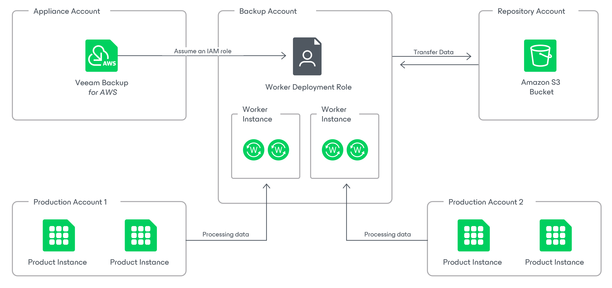
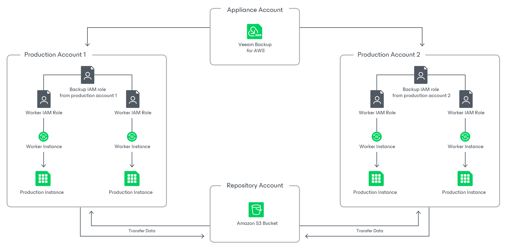

# Worker Deployment Options

Backup appliances provide the following options for deploying worker instances:

* [Worker deployment in the backup account](#backup)
* [Worker deployment in production accounts](#production)

Worker Deployment in Backup Account

The backup account is an AWS account in which backup appliances deploy worker instances to perform operations with resources belonging to either the same or any other AWS account. By default, worker instances are deployed in the backup account to perform most backup and restore operations with EC2 instances:

* [EC2 image-level backup](aws_add_policy_target_settings_backups.md)
* [Entire EC2 instance restore from image-level backups](aws_restore_entire_perform.md)
* [EC2 volume-level restore from image-level backups](aws_restore_volume_perform.md)
* [EC2 file-level recovery](aws_restore_item_perform.md)
* [EC2 backup retention tasks](aws_retention_backup.md)
* [EC2 archived tasks](aws_add_policy_target_settings_backups.md#enable_archiving)
* [RDS archived backup](aws_add_policy_target_settings_backups_rds.md)
* Health check for EC2 and RDS image-level backups

To deploy worker instances in the backup account, backup appliances employ a worker deployment role (service IAM role) that is then used to create temporary IAM roles to be attached to the deployed instances for communication with them. The backup account is defined by the worker deployment role, meaning that it is the AWS account to which this role belongs.

|  |
| --- |
| Note |
| Out of the box, backup appliances use the preconfigured Default Backup Restore role that has all the permissions required to perform data protection and disaster recovery operations. Therefore, the default backup account is an AWS account to which the backup appliance belongs. For more information on the Default Backup Restore role, see [Deploying Backup Appliance](aws_deploying_appliances.md). |

You can specify the worker deployment role in the worker instance settings as described in section [Managing Worker Instances](aws_worker_add_config_backup.md). For more information on the IAM role permissions required to deploy worker instances in the backup account, see [Worker IAM Permissions](aws_role_permissions_backup_acc.md).

How Worker Deployment in Backup Account Works

To perform a data protection or disaster recovery operation, backup appliances deploy worker instances in the following way:

1. Assume a worker deployment role to deploy the worker instances.
2. Deploy in the backup account a worker instance for each processed resource and attaches to this instance a temporary IAM role that will be used to communicate with it.
3. When the operation session completes, remove the worker instances and the temporary IAM role from AWS.

Worker Deployment in Production Accounts

Production accounts are AWS accounts in which backup appliances deploy worker instances to perform operations with processed AWS resources belonging to the same AWS accounts. By design, worker instances are deployed in production accounts to perform the following operations:

* [EFS file systems indexing](aws_add_policy_indexing_efs.md)
* [RDS image-level backup](aws_add_policy_target_settings_backups_rds.md)
* [RDS database restore from image-level backups](aws_performing_rds_database_restore.md)

Additionally, if you want to distribute workload across multiple AWS accounts and to manage resource costs for each account separately, you can instruct backup appliances to deploy worker instances in production accounts to perform the following operations:

* [EC2 image-level backup](aws_add_policy_target_settings_backups.md#workers)
* [Entire EC2 instance restore from image-level backups](aws_restore_entire_account.md#workers)
* [EC2 volume-level restore from image-level backups](aws_restore_volume_account.md#workers)
* [EC2 file-level recovery from cloud-native snapshots](aws_restore_item_mode.md#workers)

To deploy worker instances in production accounts, backup appliances employ the following IAM roles:

Worker Deployment in Production Accounts

| Role | Permissions | Settings |
| An IAM role that is used to perform an operation (that is, a backup or restore IAM role) | Depending on the operation, the role must be assigned additional permissions listed in either of the following sections:   * [EFS Backup IAM Role Permissions](aws_role_permissions_backup_efs.md) * [RDS Backup IAM Role Permissions](aws_role_permissions_backup_rds.md) * [EC2 Backup IAM Role Permissions](aws_role_permissions_backup_ec2.md) * [EC2 Restore IAM Permissions](aws_role_permissions_restore_ec2.md) | Depending on the operation, you must specify this IAM role in the backup policy or restore settings as described in either of the following sections:   * [Creating EFS Backup Policies](aws_add_policy_scope_efs.md#role) * [Creating EC2 Backup Policies](aws_add_policy_scope.md#role) * [Performing RDS Backup](aws_add_policy_scope_rds.md#role) * [Performing Entire EC2 Instance Restore](aws_restore_entire_account.md#roles) * [Performing Volume-Level Restore](aws_restore_volume_account.md#roles) * [Performing RDS Database Restore](aws_restore_rds_database_workers.md) |
| An IAM role that is attached to the deployed worker instances and further used by backup appliances to communicate with the instances (that is, a worker IAM role) | Depending on the operation, the role must be assigned permissions listed in either of the following sections:   * [Worker Deployment Role Permissions in Production Accounts](aws_role_permissions_prod_acc.md) * [FLR Worker IAM Role Permissions](aws_role_permissions_flr_prod.md) | Depending on the operation, you must specify this IAM role when enabling worker deployment in production accounts in the backup policy or restore settings, as described in either of the following sections:   * [Creating EFS Backup Policies](aws_add_policy_indexing_efs.md#enable_efs_indexing) * [Creating RDS Backup Policies](aws_add_policy_target_settings_backups_rds.md) * [Creating EC2 Backup Policies](aws_add_policy_target_settings_backups.md#workers) * [Performing RDS Database Restore](aws_restore_rds_database_workers.md#worker) * [Performing Entire EC2 Instance Restore](aws_restore_entire_account.md#workers) * [Performing Volume-Level Restore](aws_restore_volume_account.md#workers) * [Performing File-Level Recovery](aws_restore_item_mode.md#workers) |

How Worker Deployment in Production Accounts Works

To perform a data protection or disaster recovery operation, backup appliances deploy worker instances in the following way:

1. Assume a backup or restore role to deploy the worker instances.
2. Deploy in each production account a worker instance for each processed resource and attaches to this instance a pre-configured worker IAM role that will be used to communicate with it.
3. When the operation session completes, remove the worker instance from AWS. Note that backup appliances do not remove the worker IAM role since it will be used for future backup and restore operations.

Page updated 2026-05-15

