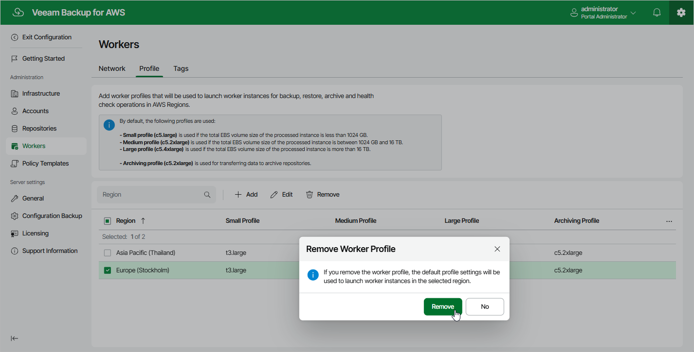

# Removing Profiles

The backup appliance allows you to permanently remove sets of worker profiles if you no longer need them. When you remove a profile set, the backup appliance does not remove currently running worker instances that have been created based on this set — these instances are removed only when the related operations complete.

To remove a profile set from the backup appliance, do the following:

1. Switch to the Configuration page.
2. Navigate to Workers > Profile.
3. Select the profile set and click Remove.

Page updated 2026-05-20

