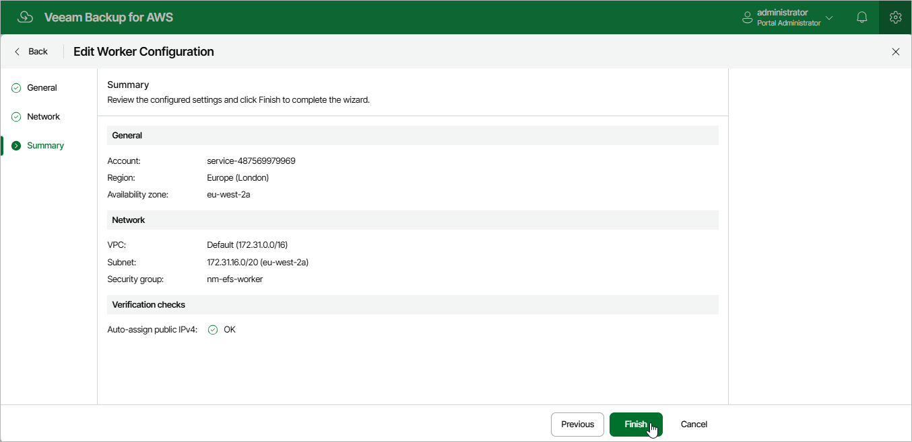

# Editing Configurations

For each worker configuration, you can modify settings specified while adding the worker configuration to the backup appliance:

1. Switch to the Configuration page.

1. Navigate to Workers > Network.
2. Switch to the necessary tab.
3. Select the worker configuration and click Edit.
4. Complete the Edit Worker Configuration wizard:

1. To change the VPC network and subnet to which the related worker instances are connected, and the security group associated with the instances, follow the instructions provided in section [Adding Configurations for Backup Account](aws_worker_configurations_backup.md) (step 3) or in section [Adding Configurations for Production Accounts](aws_worker_configurations_prod.md#region) (step 3).
2. To specify another key and value of the AWS tag associated with the security group, VPC network and subnet to which worker instances are connected, follow the instructions provided in section [Adding Configurations for Production Accounts](aws_worker_configurations_prod.md#region) (step 3).
3. At the Summary step of the wizard, review configuration information and click Finish to confirm the changes.

|  |
| --- |
| Note |
| If any worker instances are currently deployed in the selected AWS Region, the changes will be applied only when the backup appliance removes the instances from infrastructure (that is, when the running backup or restore process completes). |

Page updated 2026-05-20

