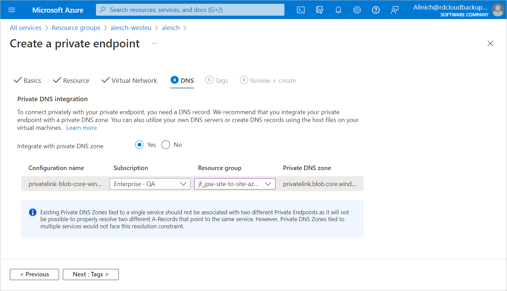

# Step 5. Specify DNS Settings

At the DNS step of the Create a private endpoint wizard, do the following:

1. In the Private DNS integration section, create a new DNS zone to override the DNS resolution from a public to private endpoint:

1. To the right of the Integrate with private DNS zone field, click Yes.
2. From the Subscription drop-down list, select a subscription to which the DNS zone will belong.
3. From the Resource group drop-down list, select the resource group to which the DNS zone will belong.

1. Click Next: Tags >.

Page updated 2023-10-13

