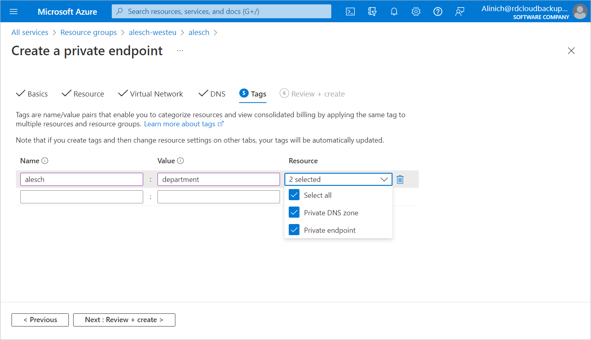

# Step 6. Assign Tags

At the Targets step of the Create a private endpoint wizard, you can assign tags to the newly created private endpoint and private DNS zone if needed.

Page updated 2023-10-13

