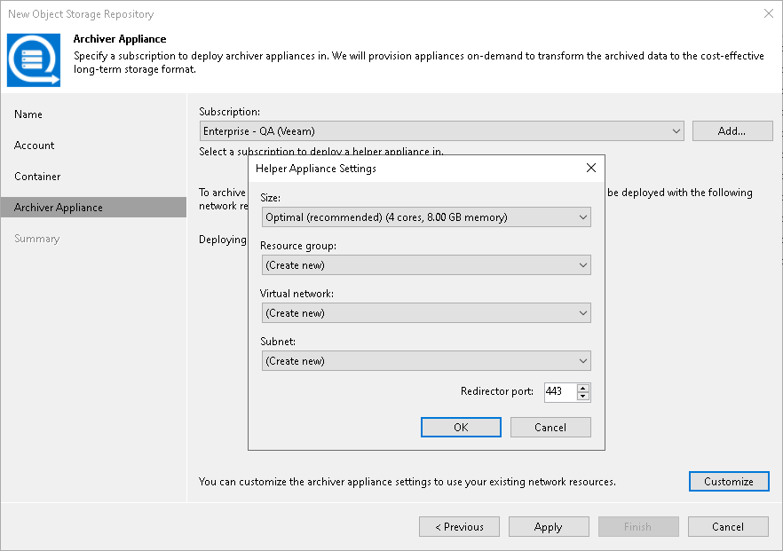

# Step 6. Specify Archiver Appliance

In this article

At the Archiver Appliance step of the wizard, you can specify archiver appliance settings. An archiver appliance is an auxiliary instance that is necessary to transfer data from Azure Blob storage to Azure Archive Storage. For more information, see the [Archiver Appliances](archiver_appliance.md) section.

|  |
| --- |
| Important |
| Consider the following:   * You must configure the archiver appliance if you transfer data from [Microsoft Azure Blob Storage](osr_adding_blob_storage.md), [Amazon S3 Storage](osr_amazon_adding.md) or [11:11 Cloud Object Storage Repository](adding_1111.md). * Veeam Backup & Replication must be able to connect to the machine that you will use as an archiver appliance. Therefore, if your backup server is not located within AWS, you must configure public IP addresses for the subnet in which the appliance resides. For more information on configuring the subnet for Amazon VPC, see [AWS Documentation](https://docs.aws.amazon.com/vpc/latest/userguide/modify-subnets.html#subnet-public-ip). |

To configure and set up an archiver appliance, you must add a Microsoft Azure account to Veeam Backup & Replication. For that, do the following:

1. From the Subscription drop-down list, select your Microsoft Azure subscription credentials. If you have not set up credentials beforehand, click Add. You will be prompted to the [Adding Microsoft Azure Compute Accounts](restore_azure_acc_launch.md) wizard. Follow the wizard to add your account. Before adding your Microsoft Azure account, check the [prerequisites](restore_azure_account_byb.md).
2. You can use the default settings or customize the archiver appliance. Click Customize and in the Helper Appliance Settings window and specify the following settings:

1. From the Size drop-down list, select the size of the appliance. For details on the proxy types used by Veeam Backup & Replication, see [this Veeam KB article](https://www.veeam.com/kb4317).
2. From the Resource group drop-down list, select a resource group that will be associated with the archiver appliance.
3. From the Virtual network drop-down list, select a network to which the archiver appliance must be connected. If you want to configure Veeam Backup & Replication to connect with Azure Blob Storage Account private endpoints, see this [Veeam KB article](https://www.veeam.com/kb4373).

|  |
| --- |
| Important |
| Veeam Backup & Replication creates a default network security group within a virtual network with the inbound rules that allow connection using the 443 and 22 ports from everywhere (0.0.0.0/0). |

1. From the Subnet drop-down list, select the subnet for the archiver appliance.
2. In the Redirector port field, specify the port that Veeam Backup & Replication will use to route requests between the archiver appliance and backup infrastructure components.
3. Click OK.

Page updated 9/4/2025

Page content applies to build 13.0.1.1071
