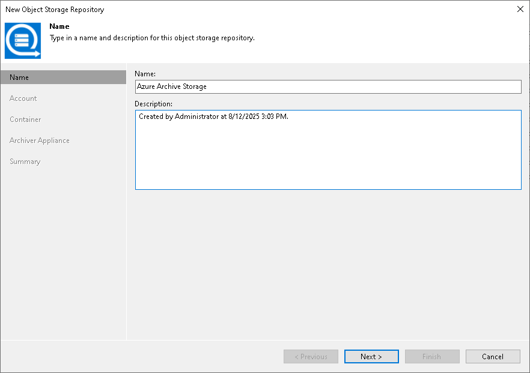

# Step 2. Specify Object Storage Name

In this article

At the Name step of the wizard, use the Name and Description fields to enter a name for a new object storage repository and to provide a description for future reference.

Page updated 8/12/2025

Page content applies to build 13.0.1.1071
