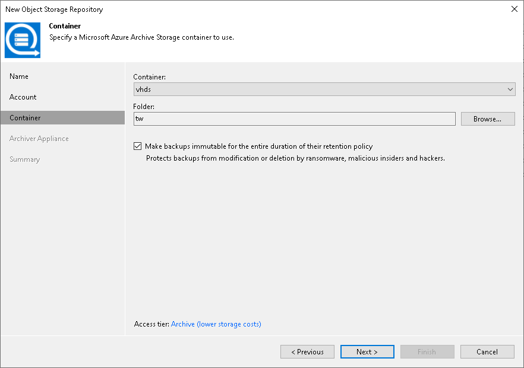
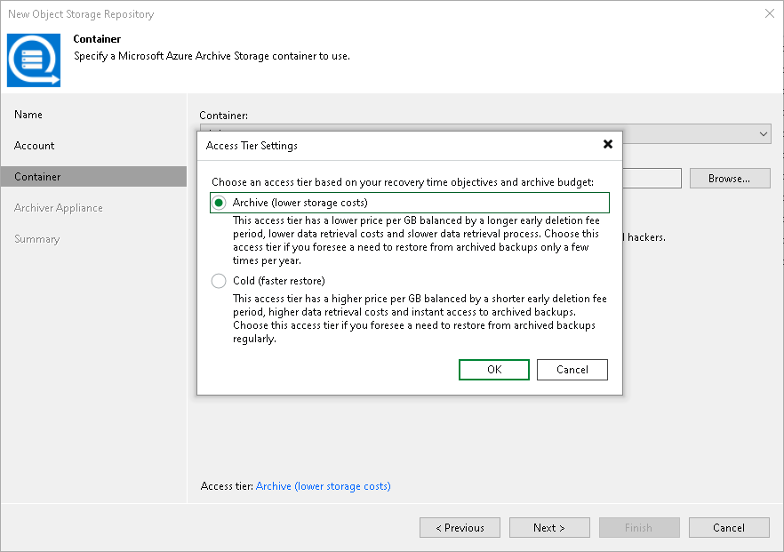

# Step 4. Specify Object Storage Settings

At the Container step of the wizard, do the following:

1. [Specify general container settings](#general).
2. [Specify Azure access tier settings](#accesstier).

Specifying General Container Settings

To specify general container settings, do the following:

1. From the Container drop-down list, select a container.

Make sure that the container where you want to store your backup data was created in advance.

1. To the right of the Folder field, click Browse and either select an existing folder or click New Folder.

1. Select the Make backups immutable for the entire duration of their retention policy check box to prohibit deletion of blocks of data from object storage. The immutability period will be equal to the retention period (if any) of the data blocks. All the types of files that are eligible for archive storage can be made immutable. For more information on the immutability feature and the retention policy for each file type, see [Immutability for Archive Tier](immutability_archive_tier.md).

Specifying Azure Access Tier Settings

Access tier settings define the cost and performance of data that you keep in Azure Blob object storage. For more information on access tiers, see [Microsoft Docs](https://learn.microsoft.com/en-us/azure/storage/blobs/access-tiers-overview).

To specify access tier settings, do the following:

1. Click the Archive link to the right of the Access tier field.
2. In the Access Tier Settings window, select one of the following:

* Archive: Use this option if you plan to access your data rarely and store it at least for 180 days.
* Cold: Use this option if you plan to access your data more frequently and store it at least for 90 days.

