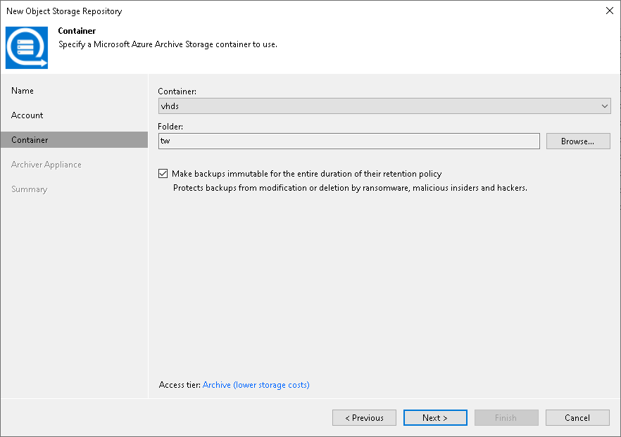
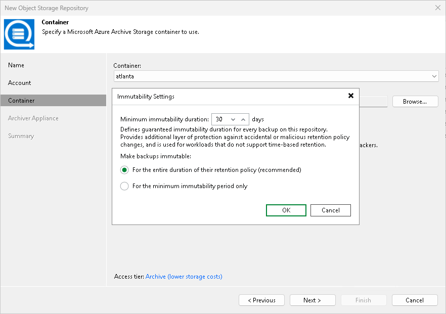
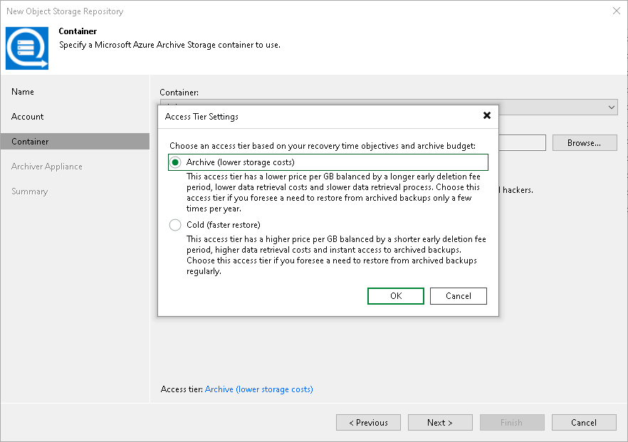

# Step 4. Specify Object Storage Settings

At the Container step of the wizard, do the following:

1. [Specify general container settings](#general).
2. [Specify immutability settings](#immutability).
3. [Specify Azure access tier settings](#accesstier).

Specifying General Container Settings

To specify general container settings, do the following:

* From the Container drop-down list, select a container.

Make sure that the container where you want to store your backup data was created in advance.

1. To the right of the Folder field, click Browse and either select an existing folder or click New Folder.

Specifying Immutability Settings

Immutability prohibits deletion of blocks of data from your object storage repository.

To enable immutability:

1. Select the Make backups immutable (recommended) check box.
2. In the Immutability Settings window, specify how the immutability period is counted and set the immutability period in days:

* Select the For the entire duration of their retention policy option if you want the immutability period depend on the retention policy of a backup job.

|  |
| --- |
| Important |
| Consider the following:   * If the GFS retention period is shorter than the minimum immutability period configured for the repository, the minimum immutability period applies. * If the GFS retention period is longer, the backup is kept for the entire GFS period.   For more information, see [Immutability for Archive Tier](immutability_archive_tier.md). |

* Select the For the minimum immutability period only option if you want to specify the immutability period explicitly. The backup job retention will be skipped.

* Next to the Minimum immutability duration option, provide the necessary value.

|  |
| --- |
| Important |
| If you create a Microsoft Entra ID application with the [Microsoft Azure Compute Account](restore_azure_accounts.md) wizard, you must manually assign the Storage Blob Data Owner role to the application. Otherwise, Veeam Backup & Replication will not be able to check or enable immutability for the container. For more information, see [Permissions](permissions_storage_account.md#entraid). If you create a Microsoft Entra ID application using the [Microsoft Azure Storage Accounts (Entra ID)](azure_entra_id.md) wizard, the Storage Blob Data Owner role is assigned to the application automatically. |

Specifying Azure Access Tier Settings

Access tier settings define the cost and performance of data that you keep in Azure Blob object storage. For more information on access tiers, see [Microsoft Docs](https://learn.microsoft.com/en-us/azure/storage/blobs/access-tiers-overview).

To specify access tier settings, do the following:

1. Click the Archive link to the right of the Access tier field.
2. In the Access Tier Settings window, select one of the following:

* Archive: Use this option if you plan to access your data rarely and store it at least for 180 days.
* Cold: Use this option if you plan to access your data more frequently and store it at least for 90 days.

Related Topics

* [Immutability for Archive Tier](immutability_archive_tier.md)

Page updated 2026-07-29

