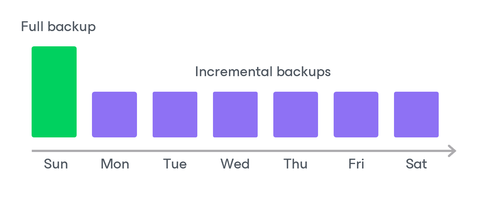

# Backup Chain

If you enable image-level backups for a backup policy, the backup appliance creates a new backup in a repository during every backup session. A sequence of backups created during a set of backup sessions makes up a backup chain.

The backup chain includes backups of the following types:

* Full — a full backup stores a copy of the full Azure VM image.
* Incremental — incremental backups store incremental changes of the Azure VM image.

To create a backup chain for an Azure VM protected by a backup policy, Veeam Backup for Microsoft Azure implements the forever forward incremental backup method:

1. During the first backup session, the backup appliance copies the full Azure VM image and creates a full backup in a repository. The full backup becomes a starting point in the backup chain.
2. During subsequent backup sessions, the backup appliance copies only those data blocks that have changed since the previous backup session, and stores these data blocks to incremental backups in the repository. The content of each incremental backup depends on the content of the full backup and the preceding incremental backups in the backup chain.

Full and incremental backups act as restore points for backed-up Azure VMs that let you roll back your data to the necessary state. To recover an Azure VM to a specific point in time, the chain of backups created for the VM must contain a full backup and a set of incremental backups dependent on the full backup.

If some backup in the backup chain is missing, you will not be able to roll back to the necessary state. For this reason, you must not delete individual backups from the repository manually. Instead, you must specify retention policy settings that will let you maintain the necessary number of backups in the repository. For more information, see [VM Backup Retention](azure_vm_backup_retention.md).

Related Topics

* [Changed Block Tracking](azure_changed_block_tracking.md)
* [Archive Backup Chain](azure_archive_chain.md)

Page updated 2026-07-01

