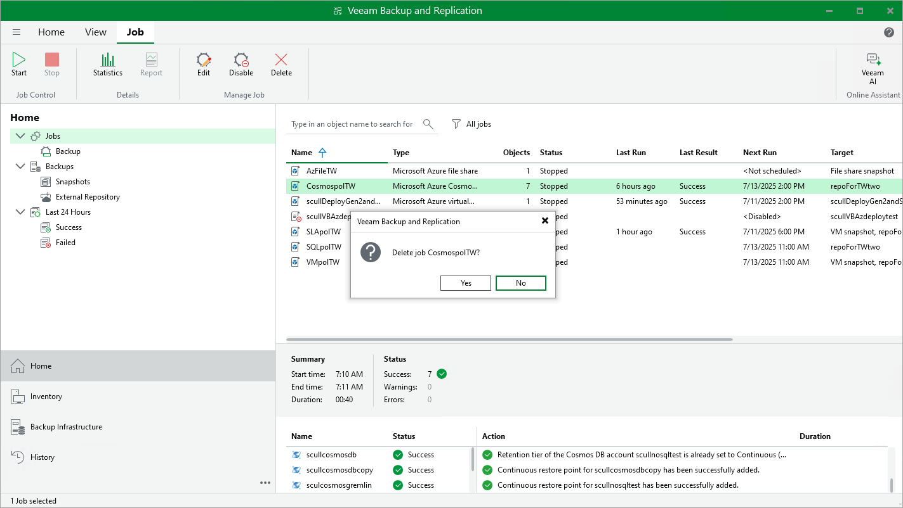

# Deleting Backup Policies

Veeam Backup & Replication allows you to permanently delete backup policies created by a backup appliance.

To delete a backup policy, do the following:

1. In the Veeam Backup & Replication console, open the Home view.
2. Navigate to Jobs.
3. Select the necessary backup policy and click Delete on the ribbon.

Alternatively, right-click the necessary backup policy and select Delete.

|  |
| --- |
| Important |
| When you delete a backup policy from Veeam Backup & Replication, the policy is automatically deleted from the backup appliance as well. |

Page updated 2026-07-01

