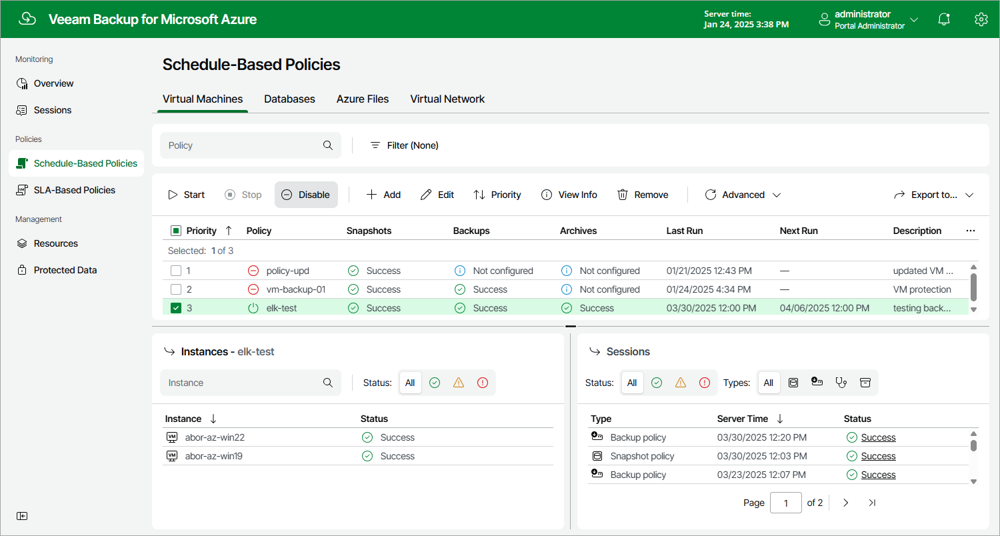

# Disabling and Enabling Backup Policies

By default, Veeam Backup & Replication runs all created backup policies according to the specified schedules. However, you can temporarily disable a backup policy so that Veeam Backup & Replication does not run the backup policy automatically. You will still be able to [manually start](azure_backup_policy_start_stop.md) or enable the disabled backup policy at any time you need.

To enable or disable a backup policy, do the following:

1. Navigate to Policies.
2. Switch to the necessary tab and select the backup policy.
3. Click Enable or Disable.

Page updated 2026-07-28

