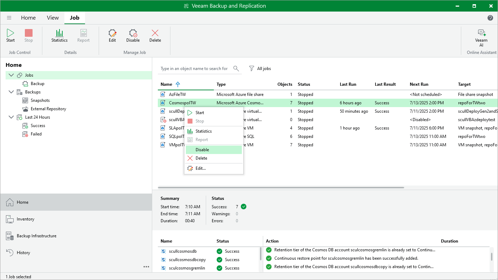

# Disabling and Enabling Backup Policies

By default, Veeam Backup & Replication runs all created backup policies according to the specified schedules. However, you can temporarily disable a backup policy so that Veeam Backup & Replication does not run the backup policy automatically. You will still be able to [manually start](azure_backup_policy_start_stop_console.md) or enable the disabled backup policy at any time you need.

To disable an enabled backup policy or to enable a disabled backup policy, do the following:

1. In the Veeam Backup & Replication console, open the Home view.
2. Navigate to Jobs.
3. Select the necessary backup policy and click Disable on the ribbon.

Alternatively, you can right-click the necessary backup policy and select Disable.

Page updated 2026-07-28

