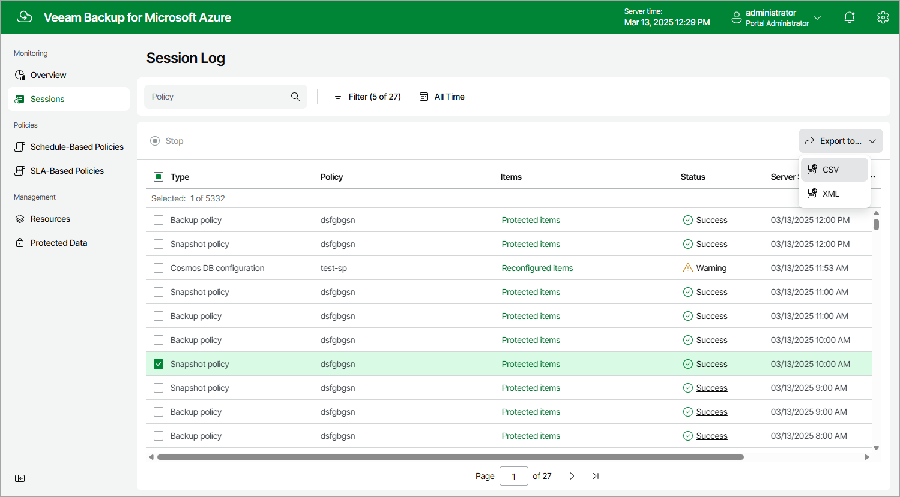

# Collecting Object Properties

You can export properties of objects managed by backup appliances as a single file in the CSV or XML format. To do that, navigate to the necessary tab, select the objects whose properties you want to export and click Export to. The backup appliance will save the file with the exported data to the default download directory on the local machine.

|  |
| --- |
| Note |
| If you do not select any objects, a backup appliance will export properties of all objects available on the tab. |

Page updated 2026-07-01

