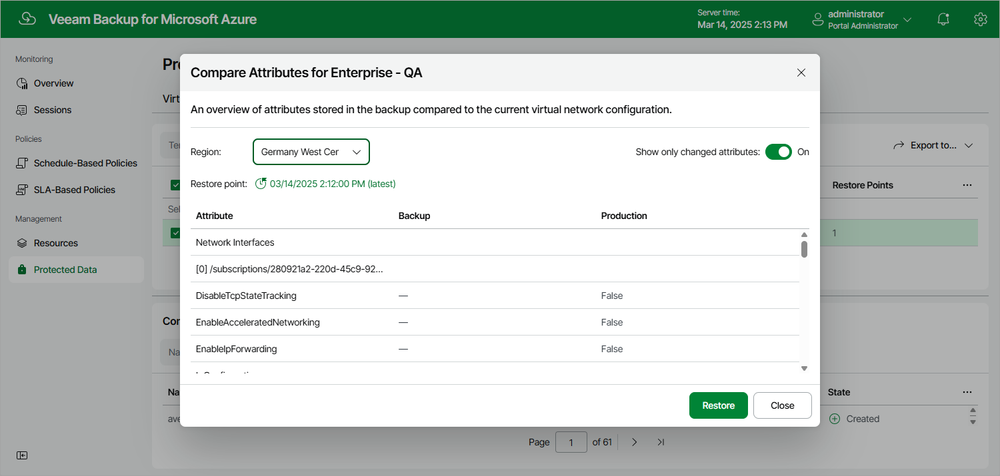

# Comparing Virtual Network Configuration Backups

You can compare the current Azure virtual network configuration of an Azure subscription and the virtual network configuration contained in any available restore point. To do that:

1. Navigate to Protected Data > Virtual Network.
2. Select the configuration record for an Azure subscription whose virtual network configuration you want to compare.
3. Click Compare.

By default, the backup appliance uses the most recent valid restore point. However, you can compare the virtual network configuration data to an earlier state. In the Compare Attributes window, click the link to the right of Restore point to select the necessary restore point.

If you want Veeam Backup for Microsoft Azure to display only backed-up virtual network configuration items that differ from the current virtual network configuration items, set the Show only changed attributes toggle to On.

Page updated 2026-07-01

