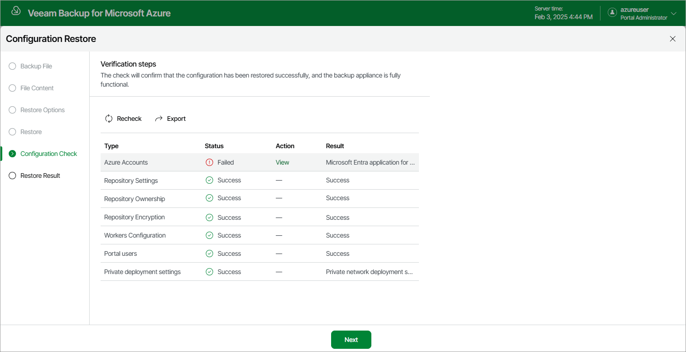

# Step 6. View Configuration Check Results

After the restore process is over, the backup appliance will run a number of verification checks to confirm that the configuration data has been restored successfully. At the Configuration Check step of the wizard, wait for the verification checks to complete and check whether the backup appliance encountered any configuration issues.

If the backup appliance encounters an issue while performing a verification check, the Result column will display a description of the issue, and the Action column will provide instructions on how to resolve it. After you resolve all issues, click Recheck to ensure the backup appliance is now fully functional, and click Next.

|  |
| --- |
| Important |
| Restored repositories must not be managed by multiple backup appliances simultaneously — retention sessions running on different backup appliances may corrupt backup files stored in the repositories, which may result in unpredictable data loss. That is why the backup appliance verifies whether the restored backup repositories are managed by any backup appliances — but only for those repositories that were added to a backup appliance version 7.0 or later. If the backup repositories are already managed by any backup appliances, the backup appliance encounters an issue while performing a verification check. To resolve the issue, you must change the owner of these repositories to complete the restore session. To do that, in the Action column, click View in the Repositories ownership field. Then, click Take Ownership in the Repository ownership window. |

Page updated 2026-07-01

