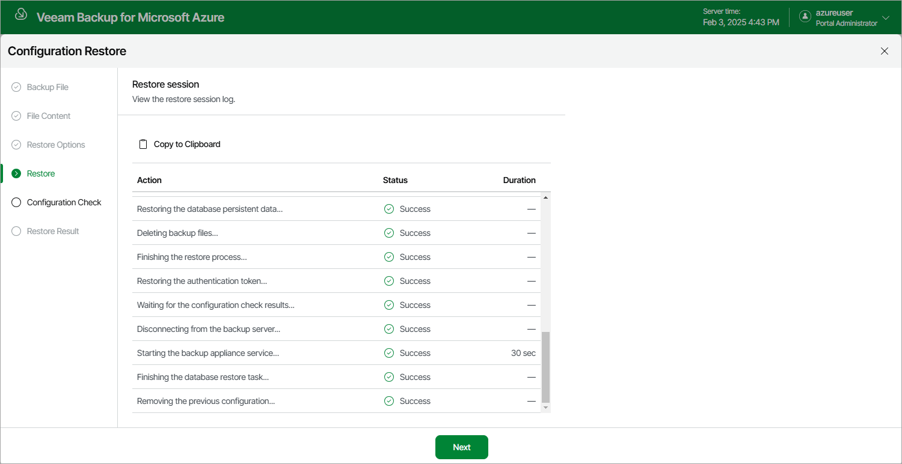

# Step 5. Track Restore Progress

The backup appliance will display the results of every step performed while executing the configuration restore. At the Restore step of the wizard, wait for the restore process to complete and click Next.

Page updated 2026-07-01

