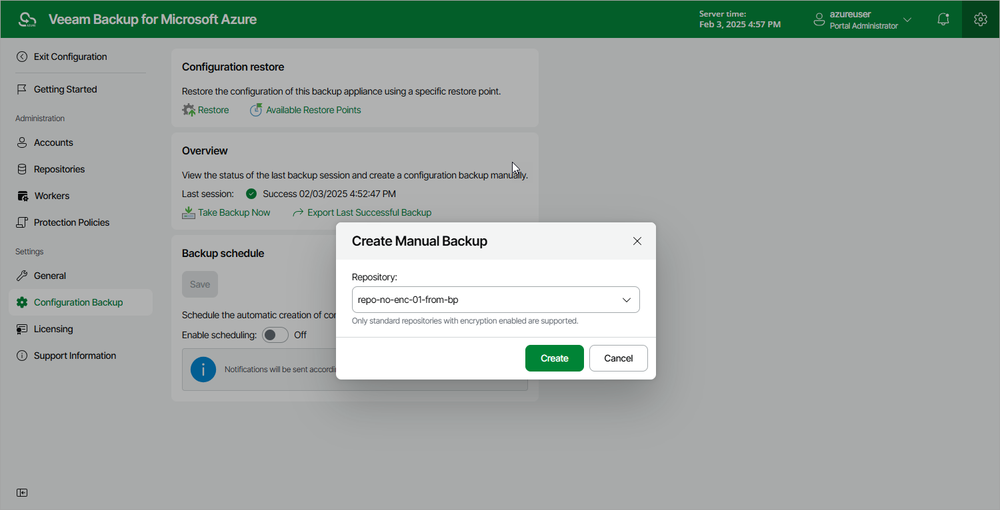

# Performing Manual Configuration Backup

While performing configuration backup, backup appliances export data from the configuration database and saves it to a backup file in a repository. To back up the configuration database of the backup appliance manually, do the following:

1. Switch to the Configuration page.
2. Navigate to Configuration Backup.
3. In the Overview section, click Take Backup Now.
4. In the Create Manual Backup window, select a backup repository where the configuration backup will be stored, and click Create.

For a backup repository to be displayed in the Repository list, it must be added to the backup appliance as described in section [Adding Backup Repositories](azure_repository_add_ui.md). The Repository list shows only backup repositories that have encryption enabled and immutability disabled.

As soon as you click Create, the backup appliance will start creating a new backup in the selected repository. To track the progress, click Go to Sessions in the Session Info window to proceed to the [Session Log page](azure_session_statistics.md).

Page updated 2026-07-01

