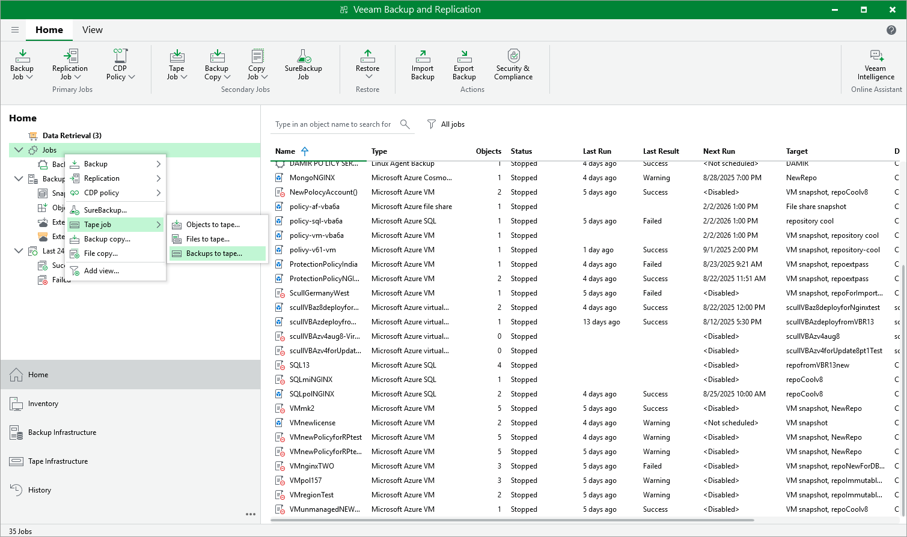

# Copying Backups to Tapes

Veeam Backup & Replication allows you to automate copying of image-level backups of Azure VMs to tape devices and lets you specify scheduling, archiving and media automation options. For more information on the supported tape libraries, see [Tape Devices Support](tape_device_support.md).

Before you start copying backup to tapes:

* Copy Azure VM backups to on-premises backup repositories. To learn how to copy backups, see the instructions provided in [Creating Backup Copy Jobs](azure_backup_copy_console.md).

* Connect tape devices to Veeam Backup & Replication as described in [Tape Devices Deployment](tape_deployment.md).
* Configure the tape infrastructure as described in [Getting Started with Tapes](getting_started_with_tapes.md) (steps 1–3).

To copy Azure VM backups to tapes, create a backup to tape job as described in [Creating Backup to Tape Jobs](creating_backup_to_tape_jobs.md).

Page updated 2026-06-26

